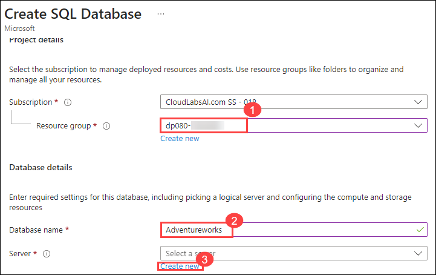
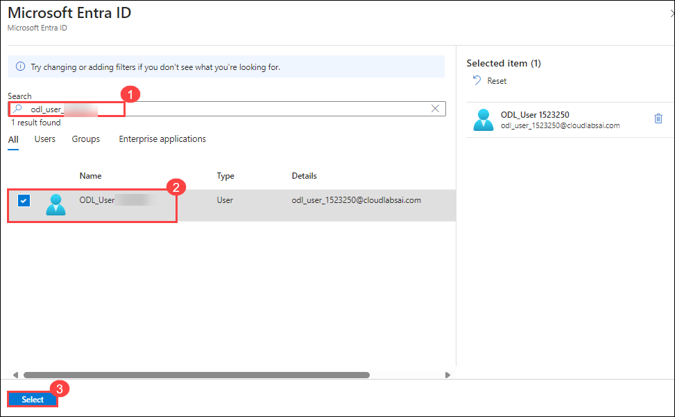
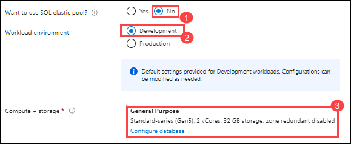
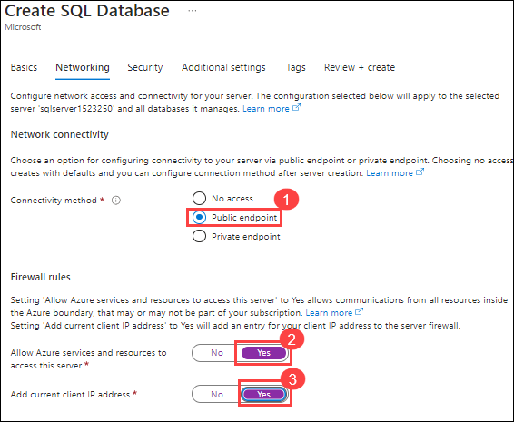
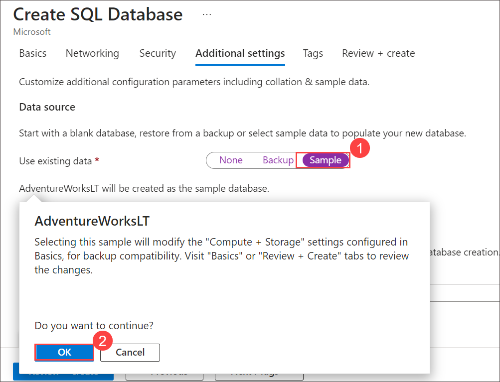

# Lab Environment Setup

You can complete the Transact-SQL exercises in a sample database in Microsoft Azure SQL Database. Use the instructions in this page to prepare a suitable Azure SQL Database environment.

> **Note**: You will need a [Microsoft Azure subscription](https://azure.microsoft.com/free) in which you have sufficient permissions to create and configure the required resources.

## Exercise 1: Deploy an Azure SQL database

Azure SQL Database is a fully managed platform as a service (PaaS) database engine that handles most database management functions like upgrading, patching, backups, and monitoring without the need for user intervention. Azure SQL Database is always running on the most recent stable version of the SQL Server database engine and a patched operating system, with 99.99% uptime. In this exercise, you are going to deploy an Azure SQL database. 

In this exercise, you will perform the following task:

+ Task 1: Create an Azure SQL database with Adventure Works pre-loaded.

### Estimated Timing: 20 minutes

### Task 1: Create an Azure SQL database with Adventure Works pre-loaded

In this task, you will learn how to use Azure portal to create a single database with Adventure works sample database

#### Steps

1. Login into Azure portal and on the search box type SQL database (1), then please select the **SQL database (2)** option from the list.

   

2. Please select the **+ Create** button.

   


3. Under **Basic** tab, please enter the following details:

    | Settings | Values |
    |  -- | -- |
    | Subscription | *Leave default subscription* |
    | Resource group | Select the resource group name **dp080-<inject key="DeploymentID" enableCopy="false"/> (1)** from the dropdown list |
    | Database name | Enter **Adventureworks (2)** |
   
     

4. For server, click **Create new (3)**.

5. On **Create SQL Database Server** page, please enter the following details and click on **Ok**

    | Settings | Values |
    |  -- | -- |      
    | Server name | **sqlserver<inject key="DeploymentID" enableCopy="false"/> (1)** |
    | Location | **East US (2)** |
    | Authentication method | **Use Microsoft Entra-only authentication (3)** |
    | Select Microsoft Entra admin | click on **Set admin (4)** and select **<inject key="AzureAdUserEmail"></inject>** from the list |
    

       

      

      

7. After creating the database server, please enter the following and click on **Next : Networking >**

    | Settings | Values |
    |  -- | -- |      
    | Want to use SQL elastic pool? | **No (1)** |    |
    | WorkLoad Environment | **Development (2)** |    |
    | Compute + storage | Make sure **General Purpose (Standard-series (Gen5), 2 vCores, 32 GB storage, zone redundant disabled) (3)** is selected using configure database option   |
    | Backup storage redundancy |  **Locally - redundant backup storage** |
    

    
 
9. On the **Networking** tab, modify the following settings as mentioned below.
   
    | Settings | Values |
    |----------|--------|
    |Connectivity method | **Public endpoint (1)** |
    |Allow Azure services and resources to access this server | **Yes (2)** |
    | Add current client IP address | **Yes (3)**  |
    | Connection policy | **Default (4)** |
    | Minimum TLS version | **TLS 1.2 (5)** |

    

    

10. Click on **Next: Security** at the bottom of the page and update the following settings as mentioned below.

    | Settings | Values |
    |----------|--------|
    | Enable Microsoft Defender for SQL | **Not now (1)** |
    | Ledger | **Not configured (2)**  |
    | Server identity | **Not enabled (3)** |
    | Server level key | **Service-managed key selected(4)** |
    | Database level key | **Not configured (5)** |
    | Enable secure enclaves | **Off (6)** |

11. Select **Next: Additional settings >** at the bottom of the page.

12. On the **Additional settings** tab, in the **Data source** section, select **Sample (1)** for Use existing data and click **Ok (2)** on the **AdventureWorksLT** dialogue box. Instead of an empty blank database, this creates an AdventureWorksLT sample database with tables and data to query and experiment with.

    

13. After selecting AdventureWorksLT sample database, please select **Review + Create**.

14. After validation is completed successfully, please select **Create**.
 
15. Once the deployment is complete, please select **Go to Resource**.

## Open the query editor

The query editor is a browser-based interface that you can use to run Transact-SQL statements in your database.

1. In the Azure portal, on the page for your **Adventureworks** SQL Database, in the pane on the left, select **Query editor**.
1. On the welcome page, sign into your database using Entra authentication (if necessary, allow access from your client IP address first).
1. In the query editor, expand the **Tables** folder to view the tables in the database.

    > **Note**: If you're familiar with the standard **AdventureWorks** sample database for Microsoft SQL Server, you may notice that we are using a simplified, lightweight (*LT*) version with fewer tables.

1. In the **Query 1** pane, enter the following Transact-SQL code:

    ```sql
    SELECT * FROM SalesLT.Product;
    ```

1. Use the **&#9655; Run** button to run the query, and and after a few seconds, review the results, which includes all columns for all products.
1. Close the Query editor page, discarding your changes if prompted.

Now that you've created the database and learned how to use the query editor to run Transact-SQL code, you can return to the query editor in the Azure Portal at any time to complete the lab exercises.


