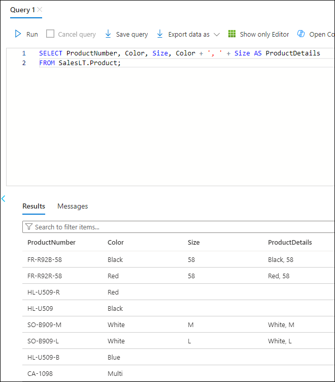
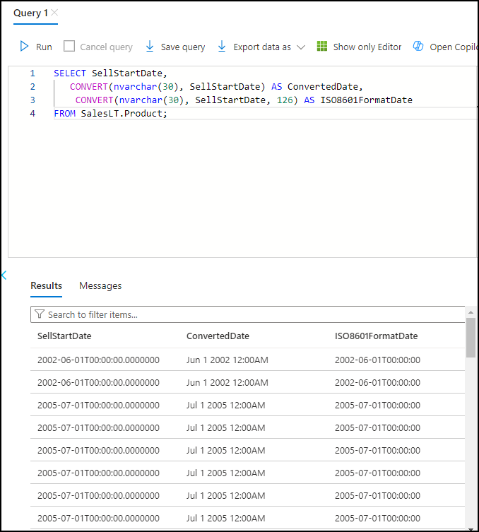
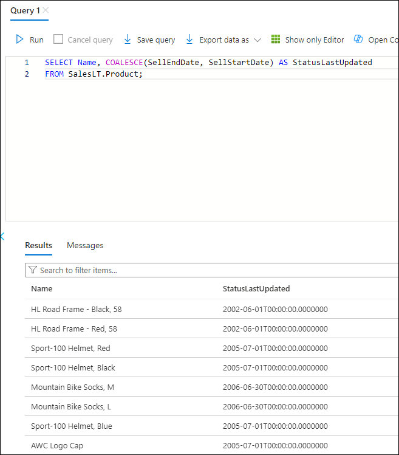
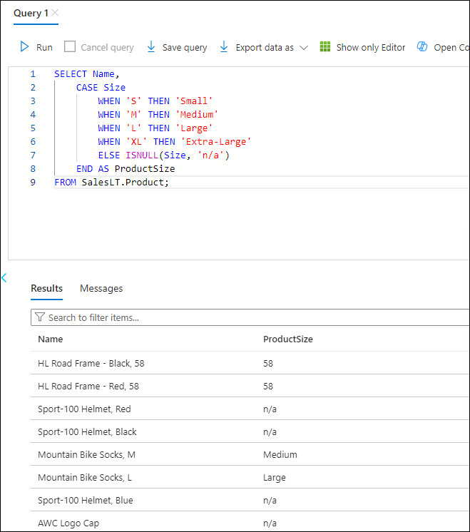

# Lab 01: Get Started with Transact-SQL
### Estimated Duration: 30 minutes
In this lab, you will use some basic SELECT queries to retrieve data from the **AdventureWorks** database.
### Lab objectives
In this lab, you will complete the following tasks:
- Task 1: Use SELECT queries to retrieve data
- Task 2: Work with data types
- Task 3: Handle NULL values

## Task 1: Use SELECT queries to retrieve data

The SELECT statement is the primary Transact-SQL statement used to query tables in a database.

1. Open a query editor for your **AdventureWorks** database, and create a new query.
1. In the query editor, enter the following code:

    ```sql
    SELECT * FROM SalesLT.Product;
    ```

1. Run the query, and and after a few seconds, review the results, which includes all columns for all products.
1. In the query editor, modify the query as follows:

    ```sql
    SELECT Name, StandardCost, ListPrice
    FROM SalesLT.Product;
    ```

1. Re-run the query, and and after a few seconds, review the results, which this time include only the **Name**, **StandardCost**, and **ListPrice** columns for all products.
1. Modify the query as shown below to include an expression that results in a calculated column, and then re-run the query:

    ```sql
    SELECT Name, ListPrice - StandardCost
    FROM SalesLT.Product;
    ```

1. Note that the results this time include the **Name** column and an unnamed numeric column containing the result of subtracting the **StandardCost** from the **ListPrice**.
1. Modify the query as shown below to assign names to the columns in the results, and then re-run the query.

    ```sql
    SELECT Name AS ProductName, ListPrice - StandardCost AS Markup
    FROM SalesLT.Product;
    ```

1. Note that the results now include columns named **ProductName** and **Markup**. The **AS** keyword has been used to assign an *alias* for each column in the results.
1. Replace the existing query with the following code, which also includes an expression that produces a calculated column in the results:

    ```sql
    SELECT ProductNumber, Color, Size, Color + ', ' + Size AS ProductDetails
    FROM SalesLT.Product;
    ```

1. Run the query, and note that the **+** operator in the calculated **ProductDetails** column is used to *concatenate* the **Color** and **Size** column values (with a literal comma between them). The behavior of this operator is determined by the data types of the columns - had they been numeric values, the **+** operator would have *added* them. Note also that some results are *NULL* - we'll explore NULL values later in this lab.

    

## Task 2: Work with data types

As you just saw, columns in a table are defined as specific data types, which affects the operations you can perform on them.

1. Replace the existing query with the following code, and run it:

    ```sql
    SELECT ProductID + ': ' + Name AS ProductName
    FROM SalesLT.Product; 
    ```

2. Note that this query returns an error. The **+** operator can be used to *concatenate* text-based values, or *add* numeric values; but in this case there's one numeric value (**ProductID**) and one text-based value (**Name**), so it's unclear how the operator should be applied.

    
3. Modify the query as follows, and re-run it:

    ```sql
    SELECT CAST(ProductID AS varchar(5)) + ': ' + Name AS ProductName
    FROM SalesLT.Product; 
    ```

4. Note that the effect of the **CAST** function is to change the numeric **ProductID** column into a **varchar** (variable-length character data) value that can be concatenated with other text-based values.

5. Modify the query to replace the **CAST** function with a **CONVERT** function as shown below, and then re-run it:

    ```sql
    SELECT CONVERT(varchar(5), ProductID) + ': ' + Name AS ProductName
    FROM SalesLT.Product; 
    ```

6. Note that the results of using **CONVERT** are the same as for **CAST**. The **CAST** function is an ANSI standard part of the SQL language that is available in most database systems, while **CONVERT** is a SQL Server specific function.

7. Another key difference between the two functions is that **CONVERT** includes an additional parameter that can be useful for formatting date and time values when converting them to text-based data. For example, replace the existing query with the following code and run it.

    ```sql
    SELECT SellStartDate,
       CONVERT(nvarchar(30), SellStartDate) AS ConvertedDate,
        CONVERT(nvarchar(30), SellStartDate, 126) AS ISO8601FormatDate
    FROM SalesLT.Product; 
    ```

    

8. Replace the existing query with the following code, and run it.

    ```sql
    SELECT Name, CAST(Size AS Integer) AS NumericSize
    FROM SalesLT.Product; 
    ```

9. Note that an error is returned because some **Size** values are not numeric (for example, some item sizes are indicated as *S*, *M*, or *L*).

10. Modify the query to use a **TRY_CAST** function, as shown here.

    ```sql
    SELECT Name, TRY_CAST(Size AS Integer) AS NumericSize
    FROM SalesLT.Product; 
    ```

11. Run the query and note that the numeric **Size** values are converted successfully to integers, but that non-numeric sizes are returned as *NULL*.

## Task 2: Handle NULL values

We've seen some examples of queries that return *NULL* values. *NULL* is generally used to denote a value that is *unknown*. Note that this is not the same as saying the value is *none* - that would imply that you *know* that the value is zero or an empty string!

1. Modify the existing query as shown here:

    ```sql
    SELECT Name, ISNULL(TRY_CAST(Size AS Integer),0) AS NumericSize
    FROM SalesLT.Product;
    ```

2. Run the query and view the results. Note that the **ISNULL** function replaces *NULL* values with the specified value, so in this case, sizes that are not numeric (and therefore can't be converted to integers) are returned as **0**.

    In this example, the **ISNULL** function is applied to the output of the inner **TRY_CAST** function, but you can also use it to deal with *NULL* values in the source table.

3. Replace the query with the following code to handle *NULL* values for **Color** and **Size** values in the source table:

    ```sql
    SELECT ProductNumber, ISNULL(Color, '') + ', ' + ISNULL(Size, '') AS ProductDetails
    FROM SalesLT.Product;
    ```

    The **ISNULL** function replaces *NULL* values with a specified literal value. Sometimes, you may want to achieve the opposite result by replacing an explicit value with *NULL*. To do this, you can use the **NULLIF** function.

4. Try the following query, which replaces the **Color** value "Multi" to *NULL*.

    ```sql
    SELECT Name, NULLIF(Color, 'Multi') AS SingleColor
    FROM SalesLT.Product;
    ```

    In some scenarios, you might want to compare multiple columns and find the first one that isn't *NULL*. For example, suppose you want to track the status of a product's availability based on the dates recorded when it was first offered for sale or removed from sale. A product that is currently available will have a **SellStartDate**, but the **SellEndDate** value will be *NULL*. When a product is no longer sold, a date is entered in its **SellEndDate** column. To find the first non-*NULL* column, you can use the **COALESCE** function.

5. Use the following query to find the first non-*NULL* date for product selling status.

    ```sql
    SELECT Name, COALESCE(SellEndDate, SellStartDate) AS StatusLastUpdated
    FROM SalesLT.Product;
    ```

    The previous query returns the last date on which the product selling status was updated, but doesn't actually tell us the sales status itself. To determine that, we'll need to check the dates to see if the **SellEndDate** is *NULL*. To do this, you can use a **CASE** expression in the **SELECT** clause to check for *NULL* **SellEndDate** values. The **CASE** expression has two variants: a *simple* **CASE** that evaluates a specific column or value, or a *searched* **CASE** that evaluates one or more expressions.

    

    In this example, our **CASE** expression must determine if the **SellEndDate** column is *NULL*. Typically, when you are trying to check the value of a column you can use the **=** operator; for example the predicate **SellEndDate = '01/01/2005'** returns **True** if the **SellEndDate** value is *01/01/2005*, and **False** otherwise. However, when dealing with *NULL* values, the default behavior may not be what you expect. Remember that *NULL* actually means *unknown*, so using the **=** operator to compare two unknown values always results in a value of *NULL* - semantically, it's impossible to know if one unknown value is the same as another. To check to see if a value is *NULL*, you must use the **IS NULL** predicate; and conversely to check that a value is not *NULL* you can use the **IS NOT NULL** predicate.

6. Run the following query, which includes *searched* **CASE** that uses an **IS NULL** expression to check for *NULL* **SellEndDate** values.

    ```sql
    SELECT Name,
        CASE
            WHEN SellEndDate IS NULL THEN 'Currently for sale'
            ELSE 'No longer available'
        END AS SalesStatus
    FROM SalesLT.Product;
    ```

    The previous query used a *searched* **CASE** expression, which begins with a **CASE** keyword, and includes one or more **WHEN...THEN** expressions with the values and predicates to be checked. An **ELSE** expression provides a value to use if none of the **WHEN** conditions are matched, and the **END** keyword denotes the end of the **CASE** expression, which is aliased to a column name for the result using an **AS** expression.

    In some queries, it's more appropriate to use a *simple* **CASE** expression that applies multiple **WHERE...THEN** predictes to the same value.

7. Run the following query to see an example of a *simple* **CASE** expression that produced different results depending on the **Size** column value.

    ```sql
    SELECT Name,
        CASE Size
            WHEN 'S' THEN 'Small'
            WHEN 'M' THEN 'Medium'
            WHEN 'L' THEN 'Large'
            WHEN 'XL' THEN 'Extra-Large'
            ELSE ISNULL(Size, 'n/a')
        END AS ProductSize
    FROM SalesLT.Product;
    ```

8. Review the query results and note that the **ProductSize** column contains the text-based description of the size for *S*, *M*, *L*, and *XL* sizes; the measurement value for numeric sizes, and *n/a* for any other sizes values.

    

## Challenges

Now that you've seen some examples of **SELECT** statements that retrieve data from a table, it's time to try to compose some queries of your own.

> **Tip**: Try to determine the appropriate queries for yourself. If you get stuck, suggested answers are provided at the end of this lab.

### Challenge 1: Retrieve customer data

Adventure Works Cycles sells directly to retailers, who then sell products to consumers. Each retailer that is an Adventure Works customer has provided a named contact for all communication from Adventure Works. The sales manager at Adventure Works has asked you to generate some reports containing details of the company’s customers to support a direct sales campaign.

1. Retrieve customer details
    - Familiarize yourself with the **SalesLT.Customer** table by writing a Transact-SQL query that retrieves all columns for all customers.
2. Retrieve customer name data
    - Create a list of all customer contact names that includes the title, first name, middle name (if any), last name, and suffix (if any) of all customers.
3. Retrieve customer names and phone numbers
    - Each customer has an assigned salesperson. You must write a query to create a call sheet that lists:
        - The salesperson
        - A column named **CustomerName** that displays how the customer contact should be greeted (for example, *Mr Smith*)
        - The customer’s phone number.

### Challenge 2: Retrieve customer order data

As you continue to work with the Adventure Works customer data, you must create queries for reports that have been requested by the sales team.

1. Retrieve a list of customer companies
    - You have been asked to provide a list of all customer companies in the format *Customer ID* : *Company Name* - for example, *78: Preferred Bikes*.
2. Retrieve a list of sales order revisions
    - The **SalesLT.SalesOrderHeader** table contains records of sales orders. You have been asked to retrieve data for a report that shows:
        - The purchase order number and revision number in the format *<Order Number> (<Revision>)* – for example *PO348186287 (2)*.
        - The order date converted to ANSI standard *102* format  (*yyyy.mm.dd* – for example *2015.01.31*).

### Challenge 3: Retrieve customer contact details

Some records in the database include missing or unknown values that are returned as NULL. You must create some queries that handle these NULL values appropriately.

1. Retrieve customer contact names with middle names if known
    - You have been asked to write a query that returns a list of customer names. The list must consist of a single column in the format *first last* (for example *Keith Harris*) if the middle name is unknown, or *first middle last* (for example *Jane M. Gates*) if a middle name is known.
2. Retrieve primary contact details
    - Customers may provide Adventure Works with an email address, a phone number, or both. If an email address is available, then it should be used as the primary contact method; if not, then the phone number should be used. You must write a query that returns a list of customer IDs in one column, and a second column named **PrimaryContact** that contains the email address if known, and otherwise the phone number.

        **IMPORTANT**: In the sample data provided, there are no customer records without an email address. Therefore, to verify that your query works as expected, run the following **UPDATE** statement to remove some existing email addresses before creating your query:

        ```sql
        UPDATE SalesLT.Customer
        SET EmailAddress = NULL
        WHERE CustomerID % 7 = 1;
        ```

3. Retrieve shipping status
    - You have been asked to create a query that returns a list of sales order IDs and order dates with a column named **ShippingStatus** that contains the text *Shipped* for orders with a known ship date, and *Awaiting Shipment* for orders with no ship date.

        **IMPORTANT**: In the sample data provided, there are no sales order header records without a ship date. Therefore, to verify that your query works as expected, run the following UPDATE statement to remove some existing ship dates before creating your query.

        ```sql
        UPDATE SalesLT.SalesOrderHeader
        SET ShipDate = NULL
        WHERE SalesOrderID > 71899;
        ```

## Challenge Solutions

This section contains suggested solutions for the challenge queries.

### Challenge 1

1. Retrieve customer details:

    ```sql
    SELECT * FROM SalesLT.Customer;
    ```

2. Retrieve customer name data:

    ```sql
    SELECT Title, FirstName, MiddleName, LastName, Suffix
    FROM SalesLT.Customer;
    ```

3. Retrieve customer names and phone numbers:

    ```sql
    SELECT Salesperson, ISNULL(Title,'') + ' ' + LastName AS CustomerName, Phone
    FROM SalesLT.Customer;
    ```

### Challenge 2

1. Retrieve a list of customer companies:

    ```sql
    SELECT CAST(CustomerID AS varchar) + ': ' + CompanyName AS CustomerCompany
    FROM SalesLT.Customer;
    ```

2. Retrieve a list of sales order revisions:

    ```sql
    SELECT PurchaseOrderNumber + ' (' + STR(RevisionNumber, 1) + ')' AS OrderRevision,
       CONVERT(nvarchar(30), OrderDate, 102) AS OrderDate
    FROM SalesLT.SalesOrderHeader;
    ```

### Challenge 3

1. Retrieve customer contact names with middle names if known:

    ```sql
    SELECT FirstName + ' ' + ISNULL(MiddleName + ' ', '') + LastName AS CustomerName
    FROM SalesLT.Customer;
    ```

2. Retrieve primary contact details:

    ```sql
    SELECT CustomerID, COALESCE(EmailAddress, Phone) AS PrimaryContact
    FROM SalesLT.Customer;
    ```

3. Retrieve shipping status:

    ```sql
    SELECT SalesOrderID, OrderDate,
        CASE
            WHEN ShipDate IS NULL THEN 'Awaiting Shipment'
            ELSE 'Shipped'
        END AS ShippingStatus
    FROM SalesLT.SalesOrderHeader;
    ```
