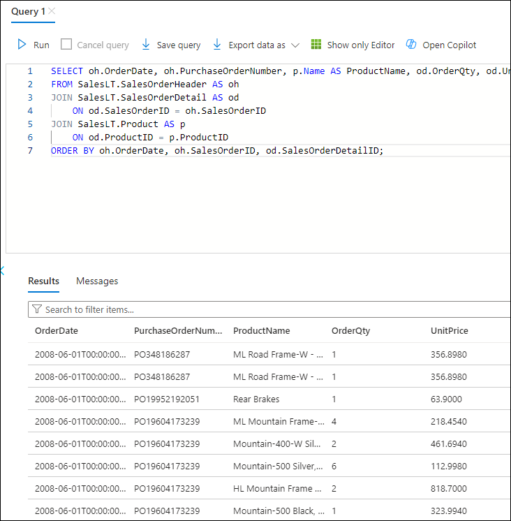
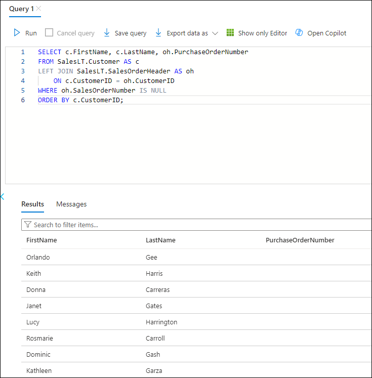
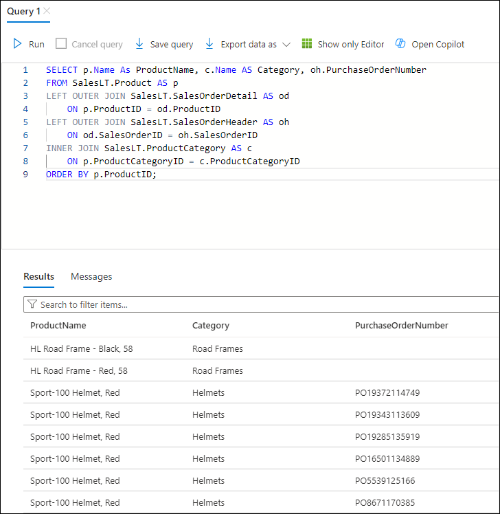

# Lab 03a: Query Multiple Tables with Joins
### Estimated Duration: 30 minutes
In this Lab, you'll use the Transact-SQL **SELECT** statement to query multiple tables in the **Adventureworks** database.
### Lab objectives
In this lab, you will complete the following tasks:
- Task 1: Use inner joins
- Task 2: Use outer joins
- Task 3: Use a cross join
- Task 4: Use a self join

## Task 1: Use inner joins
An inner join is used to find related data in two tables. For example, suppose you need to retrieve data about a product and its category from the **SalesLT.Product** and **SalesLT.ProductCategory** tables. You can find the relevant product category record for a product based on its **ProductCategoryID** field; which is a foreign-key in the product table that matches a primary key in the product category table.

1. Open a query editor for your **AdventureWorks** database, and create a new query.
1. In the query editor, enter the following code:

    ```sql
    SELECT SalesLT.Product.Name AS ProductName, SalesLT.ProductCategory.Name AS Category
    FROM SalesLT.Product
    INNER JOIN SalesLT.ProductCategory
    ON SalesLT.Product.ProductCategoryID = SalesLT.ProductCategory.ProductCategoryID;
    ```

1. Run the query, and after a few seconds, review the results, which include the **ProductName** from the products table and the corresponding **Category** from the product category table. Because the query uses an **INNER** join, any products that do not have corresponding categories, and any categories that contain no products are omitted from the results.

1. Modify the query as follows to remove the **INNER** keyword, and re-run it.

    ```sql
    SELECT SalesLT.Product.Name AS ProductName, SalesLT.ProductCategory.Name AS Category
    FROM SalesLT.Product
    JOIN SalesLT.ProductCategory
        ON SalesLT.Product.ProductCategoryID = SalesLT.ProductCategory.ProductCategoryID;
    ```

    The results should be the same as before. **INNER** joins are the default kind of join.

1. Modify the query to assign aliases to the tables in the **JOIN** clause, as shown here:

    ```sql
    SELECT p.Name AS ProductName, c.Name AS Category
    FROM SalesLT.Product AS p
    JOIN SalesLT.ProductCategory AS c
        ON p.ProductCategoryID = c.ProductCategoryID;
    ```

1. Run the modified query and confirm that it returns the same results as before. The use of table aliases can greatly simplify a query, particularly when multiple joins must be used.

1. Replace the query with the following code, which retrieves sales order data from the **SalesLT.SalesOrderHeader**, **SalesLT.SalesOrderDetail**, and **SalesLT.Product** tables:

    ```sql
    SELECT oh.OrderDate, oh.PurchaseOrderNumber, p.Name AS ProductName, od.OrderQty, od.UnitPrice
    FROM SalesLT.SalesOrderHeader AS oh
    JOIN SalesLT.SalesOrderDetail AS od
        ON od.SalesOrderID = oh.SalesOrderID
    JOIN SalesLT.Product AS p
        ON od.ProductID = p.ProductID
    ORDER BY oh.OrderDate, oh.SalesOrderID, od.SalesOrderDetailID;
    ```

1. Run the modified query and note that it returns data from all three tables.

    

## Task 2: Use outer joins

An outer join is used to retrieve all rows from one table, and any corresponding rows from a related table. In cases where a row in the outer table has no corresponding rows in the related table, *NULL* values are returned for the related table fields. For example, suppose you want to retrieve a list of all customers and any orders they have placed, including customers who have registered but never placed an order.

1. Replace the existing query with the following code:

    ```sql
    SELECT c.FirstName, c.LastName, oh.PurchaseOrderNumber
    FROM SalesLT.Customer AS c
    LEFT OUTER JOIN SalesLT.SalesOrderHeader AS oh
        ON c.CustomerID = oh.CustomerID
    ORDER BY c.CustomerID;
    ```

2. Run the query and note that the results contain data for every customer. If a customer has placed an order, the order number is shown. Customers who have registered but not placed an order are shown with a *NULL* order number.


    Note the use of the **LEFT** keyword. This identifies which of the tables in the join is the *outer* table (the one from which all rows should be preserved). In this case, the join is between the **Customer** and **SalesOrderHeader** tables, so a **LEFT** join designates **Customer** as the outer table. Had a **RIGHT** join been used, the query would have returned all records from the **SalesOrderHeader** table and only matching data from the **Customer** table (in other words, all orders including those for which there was no matching customer record). You can also use a **FULL** outer join to preserve unmatched rows from *both* sides of the join (all customers, including those who haven't placed an order; and all orders, including those with no matching customer), though in practice this is used less frequently.

3. Modify the query to remove the **OUTER** keyword, as shown here:

    ```sql
    SELECT c.FirstName, c.LastName, oh.PurchaseOrderNumber
    FROM SalesLT.Customer AS c
    LEFT JOIN SalesLT.SalesOrderHeader AS oh
        ON c.CustomerID = oh.CustomerID
    ORDER BY c.CustomerID;
    ```

4. Run the query and review the results, which should be the same as before. Using the **LEFT** (or **RIGHT**) keyword automatically identifies the join as an **OUTER** join.
5. Modify the query as shown below to take advantage of the fact that it identifies non-matching rows and return only the customers who have not placed any orders.

    ```sql
    SELECT c.FirstName, c.LastName, oh.PurchaseOrderNumber
    FROM SalesLT.Customer AS c
    LEFT JOIN SalesLT.SalesOrderHeader AS oh
        ON c.CustomerID = oh.CustomerID
    WHERE oh.SalesOrderNumber IS NULL 
    ORDER BY c.CustomerID;
    ```

6. Run the query and review the results, which contain data for customers who have not placed any orders.

    
7. Replace the query with the following one, which uses outer joins to retrieve data from three tables.

    ```sql
    SELECT p.Name As ProductName, oh.PurchaseOrderNumber
    FROM SalesLT.Product AS p
    LEFT JOIN SalesLT.SalesOrderDetail AS od
        ON p.ProductID = od.ProductID
    LEFT JOIN SalesLT.SalesOrderHeader AS oh
        ON od.SalesOrderID = oh.SalesOrderID
    ORDER BY p.ProductID;
    ```

8. Run the query and note that the results include all products, with order numbers for any that have been purchased. This required a sequence of joins from **Product** to **SalesOrderDetail** to **SalesOrderHeader**. Note that when you join multiple tables like this, after an outer join has been specified in the join sequence, all subsequent outer joins must be of the same direction  (**LEFT** or **RIGHT**).
9. Modify the query as shown below to add an inner join to return category information. When mixing inner and outer joins, it can be helpful to be explicit about the join types by using the **INNER** and **OUTER** keywords.

    ```sql
    SELECT p.Name As ProductName, c.Name AS Category, oh.PurchaseOrderNumber
    FROM SalesLT.Product AS p
    LEFT OUTER JOIN SalesLT.SalesOrderDetail AS od
        ON p.ProductID = od.ProductID
    LEFT OUTER JOIN SalesLT.SalesOrderHeader AS oh
        ON od.SalesOrderID = oh.SalesOrderID
    INNER JOIN SalesLT.ProductCategory AS c
        ON p.ProductCategoryID = c.ProductCategoryID
    ORDER BY p.ProductID;
    ```

10. Run the query and review the results, which include product names, categories, and sales order numbers.

    

## Task 3: Use a cross join

A *cross* join matches all possible combinations of rows from the tables being joined. In practice, it's rarely used; but there are some specialized cases where it is useful.

1. Replace the existing query with the following code:

    ```sql
    SELECT p.Name, c.FirstName, c.LastName, c.EmailAddress
    FROM SalesLT.Product AS p
    CROSS JOIN SalesLT.Customer AS c;
    ```

2. Run the query and note that the results contain a row for every product and customer combination (which might be used to create a mailing campaign in which an indivdual advertisement for each product is emailed to each customer - a strategy that may not endear the company to its customers!).

## Task 4: Use a self join

A *self* join isn't actually a specific kind of join, but it's a technique used to join a table to itself by defining two instances of the table, each with its own alias. This approach can be useful when a row in the table includes a foreign key field that references the primary key of the same table; for example in a table of employees where an employee's manager is also an employee, or a table of product categories where each category might be a subcategory of another category.

1. Replace the existing query with the following code, which includes a self join between two instances of the **SalesLT.ProductCategory** table (with aliases **cat** and **pcat**):

    ```sql
    SELECT pcat.Name AS ParentCategory, cat.Name AS SubCategory
    FROM SalesLT.ProductCategory AS cat
    JOIN SalesLT.ProductCategory pcat
        ON cat.ParentProductCategoryID = pcat.ProductCategoryID
    ORDER BY ParentCategory, SubCategory;
    ```

2. Run the query and review the results, which reflect the hierarchy of parent and sub categories.

## Challenges

Now that you've seen some examples of joins, it's your turn to try retrieving data from multiple tables for yourself.

> **Tip**: Try to determine the appropriate queries for yourself. If you get stuck, suggested answers are provided at the end of this lab.

### Challenge 1: Generate invoice reports

Adventure Works Cycles sells directly to retailers, who must be invoiced for their orders. You have been tasked with writing a query to generate a list of invoices to be sent to customers.

1. Retrieve customer orders
    - As an initial step towards generating the invoice report, write a query that returns the company name from the **SalesLT.Customer** table, and the purchase order number and total due (calculated as the sub-total + tax + freight) from the **SalesLT.SalesOrderHeader** table.
2. Retrieve customer orders with addresses
    - Extend your customer orders query to include the *Main Office* address for each customer, including the full street address, city, state or province, postal code, and country or region
    - **Tip**: Note that each customer can have multiple addressees in the **SalesLT.Address** table, so the database developer has created the **SalesLT.CustomerAddress** table to enable a many-to-many relationship between customers and addresses. Your query will need to include both of these tables, and should filter the results so that only *Main Office* addresses are included.

### Challenge 2: Retrieve customer data

As you continue to work with the Adventure Works customer and sales data, you must create queries for reports that have been requested by the sales team.

1. Retrieve a list of all customers and their orders
    - The sales manager wants a list of all customer companies and their contacts (first name and last name), showing the purchase order number and total due for each order they have placed. Customers who have not placed any orders should be included at the bottom of the list with NULL values for the purchase order number and total due.
2. Retrieve a list of customers with no address
    - A sales employee has noticed that Adventure Works does not have address information for all customers. You must write a query that returns a list of customer IDs, company names, contact names (first name and last name), and phone numbers for customers with no address stored in the database.

### Challenge 3: Create a product catalog

The marketing team has asked you to retrieve data for a new product catalog.

1. Retrieve product information by category
    - The product catalog will list products by parent category and subcategory, so you must write a query that retrieves the parent category name, subcategory name, and product name fields for the catalog.

## Challenge Solutions

This section contains suggested solutions for the challenge queries.

### Challenge 1

1. Retrieve customer orders:

    ```sql
    SELECT c.CompanyName,
           oh.PurchaseOrderNumber,
           oh.SubTotal + oh.TaxAmt + oh.Freight As TotalDue
    FROM SalesLT.Customer AS c
    JOIN SalesLT.SalesOrderHeader AS oh
        ON oh.CustomerID = c.CustomerID;
        ```
 
2. Retrieve customer orders with addresses:

    ```sql
    SELECT c.CompanyName,
           a.AddressLine1,
           ISNULL(a.AddressLine2, '') AS AddressLine2,
           a.City,
           a.StateProvince,
           a.PostalCode,
           a.CountryRegion,
           oh.PurchaseOrderNumber,
           oh.SubTotal + oh.TaxAmt + oh.Freight As TotalDue
    FROM SalesLT.Customer AS c
    JOIN SalesLT.SalesOrderHeader AS oh
        ON oh.CustomerID = c.CustomerID
    JOIN SalesLT.CustomerAddress AS ca
        ON c.CustomerID = ca.CustomerID
    JOIN SalesLT.Address AS a
        ON ca.AddressID = a.AddressID
    WHERE ca.AddressType = 'Main Office';
    ```

### Challenge 2

1. Retrieve a list of all customers and their orders:

    ```sql
    SELECT c.CompanyName, c.FirstName, c.LastName,
           oh.PurchaseOrderNumber,
           oh.SubTotal + oh.TaxAmt + oh.Freight As TotalDue
    FROM SalesLT.Customer AS c
    LEFT JOIN SalesLT.SalesOrderHeader AS oh
        ON c.CustomerID = oh.CustomerID
    ORDER BY oh.PurchaseOrderNumber DESC;
    ```

2. Retrieve a list of customers with no address:

    ```sql
    SELECT c.CompanyName, c.FirstName, c.LastName, c.Phone
    FROM SalesLT.Customer AS c
    LEFT JOIN SalesLT.CustomerAddress AS ca
        ON c.CustomerID = ca.CustomerID
    WHERE ca.AddressID IS NULL;
    ```

### Challenge 3

1. Retrieve product information by category:

    ```sql
    SELECT pcat.Name AS ParentCategory, cat.Name AS SubCategory, prd.Name AS ProductName
    FROM SalesLT.ProductCategory pcat
    JOIN SalesLT.ProductCategory AS cat
        ON pcat.ProductCategoryID = cat.ParentProductCategoryID
    JOIN SalesLT.Product AS prd
        ON prd.ProductCategoryID = cat.ProductCategoryID
    ORDER BY ParentCategory, SubCategory, ProductName;
    ```
