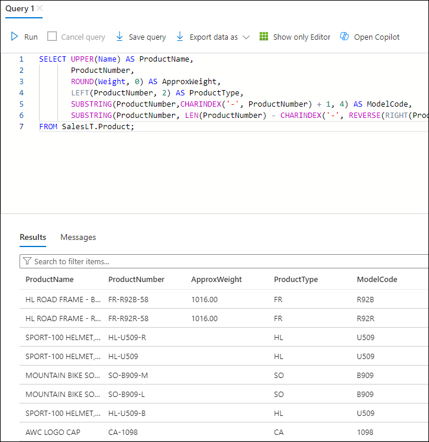
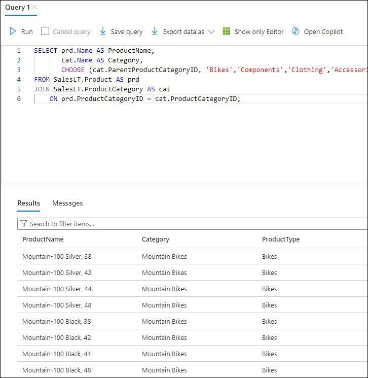
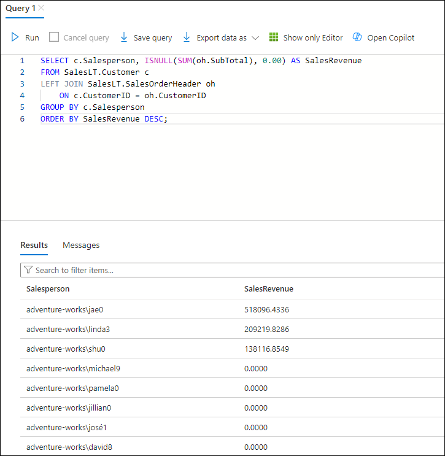
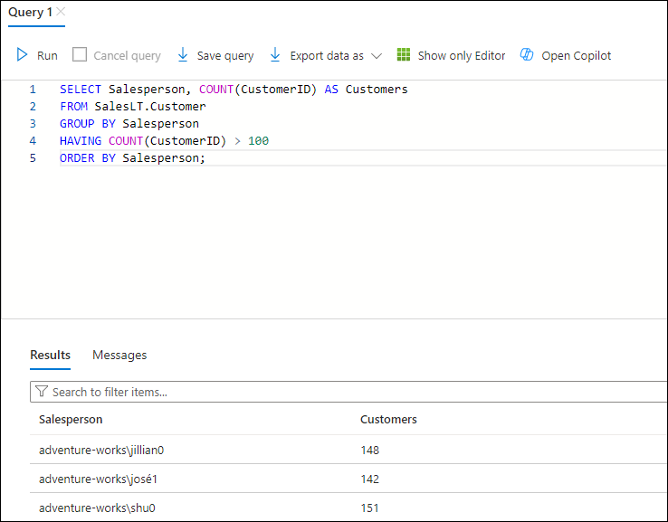

# Lab 04: Use Built-in Functions
### Estimated Duration: 30 minutes
In this Lab, you'll use built-in functions to retrieve and aggregate data in the **Adventureworks** database.

### Lab objectives
In this lab, you will complete the following tasks:
- Task 1: Scalar functions
- Task 2: Use logical functions
- Task 3: Use aggregate functions
- Task 4: Group aggregated results with the GROUP BY clause
- Task 5: Filter groups with the HAVING clause

## Task 1: Scalar functions

Transact-SQL provides a large number of functions that you can use to extract additional information from your data. Most of these functions are *scalar* functions that return a single value based on one or more input parameters, often a data field.

**Tip**: We don't have enough time in this exercise to explore every function available in Transact-SQL. To learn more about the functions covered in this exercise, and more, view the [Transact-SQL documentation](https://docs.microsoft.com/sql/t-sql/functions/functions).

1. Open a query editor for your **AdventureWorks** database, and create a new query.
1. In the query editor, enter the following code:

    ```sql
    SELECT YEAR(SellStartDate) AS SellStartYear, ProductID, Name
    FROM SalesLT.Product
    ORDER BY SellStartYear;
    ```

1. Run the query, and and after a few seconds, review the results, noting that the **YEAR** function has retrieved the year from the **SellStartDate** field.

1. Modify the query as follows to use some additional scalar functions that operate on *datetime* values.

    ```sql
    SELECT YEAR(SellStartDate) AS SellStartYear,
           DATENAME(mm,SellStartDate) AS SellStartMonth,
           DAY(SellStartDate) AS SellStartDay,
           DATENAME(dw, SellStartDate) AS SellStartWeekday,
           DATEDIFF(yy,SellStartDate, GETDATE()) AS YearsSold,
           ProductID,
           Name
    FROM SalesLT.Product
    ORDER BY SellStartYear;
    ```

1. Run the query and review the results.

    

    Note that the **DATENAME** function returns a different value depending on the *datepart* parameter that is passed to it. In this example, **mm** returns the month name, and **dw** returns the weekday name.

    Note also that the **DATEDIFF** function returns the specified time interval between and start date and an end date. In this case the interval is measured in years (**yy**), and the end date is determined by the **GETDATE** function; which when used with no parameters returns the current date and time.

1. Replace the existing query with the following code.

    ```sql
    SELECT CONCAT(FirstName + ' ', LastName) AS FullName
    FROM SalesLT.Customer;
    ```

1. Run the query and note that it returns the concatenated first and last name for each customer.
1. Replace the query with the following code to explore some more functions that manipulate string-based values.

    ```sql
    SELECT UPPER(Name) AS ProductName,
           ProductNumber,
           ROUND(Weight, 0) AS ApproxWeight,
           LEFT(ProductNumber, 2) AS ProductType,
           SUBSTRING(ProductNumber,CHARINDEX('-', ProductNumber) + 1, 4) AS ModelCode,
           SUBSTRING(ProductNumber, LEN(ProductNumber) - CHARINDEX('-', REVERSE(RIGHT(ProductNumber, 3))) + 2, 2) AS SizeCode
    FROM SalesLT.Product;
    ```

1. Run the query and note that it returns the following data:
    - The product name, converted to upper case by the **UPPER** function.
    - The product number, which is a string code that encapsulates details of the product.
    - The weight of the product, rounded to the nearest whole number by using the **ROUND** function.
    - The product type, which is indicated by the first two characters of the product number, starting from the left (using the **LEFT** function).
    - The model code, which is extracted from the product number by using the **SUBSTRING** function, which extracts the four characters immediately following the first *-* character, which is found using the **CHARINDEX** function.
    - The size code, which is extracted using the **SUBSTRING** function to extract the two characters following the last *-* in the product code. The last *-* character is found by taking the total length (**LEN**) of the product ID and finding its index (**CHARINDEX**) in the reversed (**REVERSE**) first three characters from the right (**RIGHT**). This example shows how you can combine functions to apply fairly complex logic to extract the values you need.

        

## Task 2: Use logical functions

*Logical* functions are used to apply logical tests to values, and return an appropriate value based on the results of the logical evaluation.

1. Replace the existing query with the following code.

    ```sql
    SELECT Name, Size AS NumericSize
    FROM SalesLT.Product
    WHERE ISNUMERIC(Size) = 1;
    ```

2. Run the query and note that the results only products with a numeric size.
3. Replace the query with the following code, which nests the **ISNUMERIC** function used previously in an **IIF** function; which in turn evaluates the result of the **ISNUMERIC** function and returns *Numeric* if the result is **1** (*true*), and *Non-Numeric* otherwise.

    ```sql
    SELECT Name, IIF(ISNUMERIC(Size) = 1, 'Numeric', 'Non-Numeric') AS SizeType
    FROM SalesLT.Product;
    ```

4. Run the query and review the results.
5. Replace the query with the following code:

    ```sql
    SELECT prd.Name AS ProductName,
           cat.Name AS Category,
           CHOOSE (cat.ParentProductCategoryID, 'Bikes','Components','Clothing','Accessories') AS ProductType
    FROM SalesLT.Product AS prd
    JOIN SalesLT.ProductCategory AS cat
        ON prd.ProductCategoryID = cat.ProductCategoryID;
    ```

6. Run the query and note that the **CHOOSE** function returns the value in the ordinal position in a list based on the a specified index value. The list index is 1-based so in this query the function returns *Bikes* for category 1, *Components* for category 2, and so on.

    

## Task 3: Use aggregate functions

*Aggregate* functions return an aggregated value, such as a sum, count, average, minimum, or maximum.

1. Replace the existing query with the following code.

    ```sql
    SELECT COUNT(*) AS Products,
           COUNT(DISTINCT ProductCategoryID) AS Categories,
           AVG(ListPrice) AS AveragePrice
    FROM SalesLT.Product;
    ```

2. Run the query and note that the following aggregations are returned:
    - The number of products in the table. This is returned by using the **COUNT** function to count the number of rows (**\***).
    - The number of categories. This is returned by using rhe **COUNT** function to count the number of distinct category IDs in the table.
    - The average price of a product. This is returned by using the **AVG** function with the **ListPrice** field.
3. Replace the query with the following code.

    ```sql
    SELECT COUNT(p.ProductID) AS BikeModels, AVG(p.ListPrice) AS AveragePrice
    FROM SalesLT.Product AS p
    JOIN SalesLT.ProductCategory AS c
        ON p.ProductCategoryID = c.ProductCategoryID
    WHERE c.Name LIKE '%Bikes';
    ```

4. Run the query, noting that it returns the number of models and the average price for products with category names that end in "bikes".

## Task 4: Group aggregated results with the GROUP BY clause

Aggregate functions are especially useful when combined with the **GROUP BY** clause to calculate aggregations for different groups of data.

1. Replace the existing query with the following code.

    ```sql
    SELECT Salesperson, COUNT(CustomerID) AS Customers
    FROM SalesLT.Customer
    GROUP BY Salesperson
    ORDER BY Salesperson;
    ```

2. Run the query and note that it returns the number of customers assigned to each salesperson.
3. Replace the query with the following code:

    ```sql
    SELECT c.Salesperson, SUM(oh.SubTotal) AS SalesRevenue
    FROM SalesLT.Customer c
    JOIN SalesLT.SalesOrderHeader oh
        ON c.CustomerID = oh.CustomerID
    GROUP BY c.Salesperson
    ORDER BY SalesRevenue DESC;
    ```

4. Run the query, noting that it returns the total sales revenue for each salesperson who has completed any sales.
5. Modify the query as follows to use an outer join:

    ```sql
    SELECT c.Salesperson, ISNULL(SUM(oh.SubTotal), 0.00) AS SalesRevenue
    FROM SalesLT.Customer c
    LEFT JOIN SalesLT.SalesOrderHeader oh
        ON c.CustomerID = oh.CustomerID
    GROUP BY c.Salesperson
    ORDER BY SalesRevenue DESC;
    ```

6. Run the query, noting that it returns the sales totals for salespeople who have sold items, and 0.00 for those who haven't.

    

## Task 5: Filter groups with the HAVING clause

After grouping data, you may want to filter the results to include only the groups that meet specified criteria. For example, you may want to return only salespeople with more than 100 customers.

1. Replace the existing query with the following code, which you may think would return salespeople with more than 100 customers (but you'd be wrong, as you will see!)

    ```sql
    SELECT Salesperson, COUNT(CustomerID) AS Customers
    FROM SalesLT.Customer
    WHERE COUNT(CustomerID) > 100
    GROUP BY Salesperson
    ORDER BY Salesperson;
    ```

2. Run the query and note that it returns an error. The **WHERE** clause is applied *before* the aggregations and the **GROUP BY** clause, so you can't use it to filter on the aggregated value.
3. Modify the query as follows to add a **HAVING** clause, which is applied *after* the aggregations and **GROUP BY** clause.

    ```sql
    SELECT Salesperson, COUNT(CustomerID) AS Customers
    FROM SalesLT.Customer
    GROUP BY Salesperson
    HAVING COUNT(CustomerID) > 100
    ORDER BY Salesperson;
    ```

4. Run the query, and note that it returns only salespeople who have more than 100 customers assigned to them.

    

## Challenges

Now it's time to try using functions to retrieve data in some queries of your own.

> **Tip**: Try to determine the appropriate queries for yourself. If you get stuck, suggested answers are provided at the end of this lab.

### Challenge 1: Retrieve order shipping information

The operations manager wants reports about order shipping based on data in the **SalesLT.SalesOrderHeader** table.

1. Retrieve the order ID and freight cost of each order.
    - Write a query to return the order ID for each order, together with the the **Freight** value rounded to two decimal places in a column named **FreightCost**.
2. Add the shipping method.
    - Extend your query to include a column named **ShippingMethod** that contains the **ShipMethod** field, formatted in lower case.
3. Add shipping date details.
    - Extend your query to include columns named **ShipYear**, **ShipMonth**, and **ShipDay** that contain the year, month, and day of the **ShipDate**. The **ShipMonth** value should be displayed as the month name (for example, *June*)

### Challenge 2: Aggregate product sales

The sales manager would like reports that include aggregated information about product sales.

1. Retrieve total sales by product
    - Write a query to retrieve a list of the product names from the **SalesLT.Product** table and the total number of sales of each product, calculated as the sum of **OrderQty** from the **SalesLT.SalesOrderDetail** table, with the results sorted in descending order of total sales.
2. Filter the product sales list to include only products that cost over 1,000
    - Modify the previous query to include only sales of products that have a list price of more than 1000.
3. Filter the product sales groups to include only products for which over 20 have been sold
    - Modify the previous query to only include only product groups with a total order quantity greater than 20.

## Challenge Solutions

This section contains suggested solutions for the challenge queries.

### Challenge 1

1. Retrieve the order ID and freight cost of each order:

    ```sql
    SELECT SalesOrderID,
           ROUND(Freight, 2) AS FreightCost
    FROM SalesLT.SalesOrderHeader;
    ```

2. Add the shipping method:

    ```sql
    SELECT SalesOrderID,
           ROUND(Freight, 2) AS FreightCost,
           LOWER(ShipMethod) AS ShippingMethod
    FROM SalesLT.SalesOrderHeader;
    ```

3. Add shipping date details:

    ```sql
    SELECT SalesOrderID,
           ROUND(Freight, 2) AS FreightCost,
           LOWER(ShipMethod) AS ShippingMethod,
           YEAR(ShipDate) AS ShipYear,
           DATENAME(mm, ShipDate) AS ShipMonth,
           DAY(ShipDate) AS ShipDay
    FROM SalesLT.SalesOrderHeader;
    ```

### Challenge 2

The product manager would like reports that include aggregated information about product sales.

1. Retrieve total sales by product:

    ```sql
    SELECT p.Name,SUM(o.OrderQty) AS TotalSales
    FROM SalesLT.SalesOrderDetail AS o
    JOIN SalesLT.Product AS p
        ON o.ProductID = p.ProductID
    GROUP BY p.Name
    ORDER BY TotalSales DESC;
    ```

2. Filter the product sales list to include only products that cost over 1,000:

    ```sql
    SELECT p.Name,SUM(o.OrderQty) AS TotalSales
    FROM SalesLT.SalesOrderDetail AS o
    JOIN SalesLT.Product AS p
        ON o.ProductID = p.ProductID
    WHERE p.ListPrice > 1000
    GROUP BY p.Name
    ORDER BY TotalSales DESC;
    ```

3. Filter the product sales groups to include only products for which over 20 have been sold:

    ```sql
    SELECT p.Name,SUM(o.OrderQty) AS TotalSales
    FROM SalesLT.SalesOrderDetail AS o
    JOIN SalesLT.Product AS p
        ON o.ProductID = p.ProductID
    WHERE p.ListPrice > 1000
    GROUP BY p.Name
    HAVING SUM(o.OrderQty) > 20
    ORDER BY TotalSales DESC;
    ```
