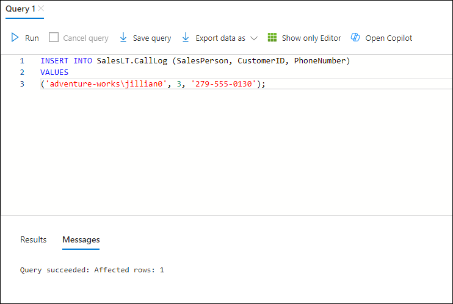
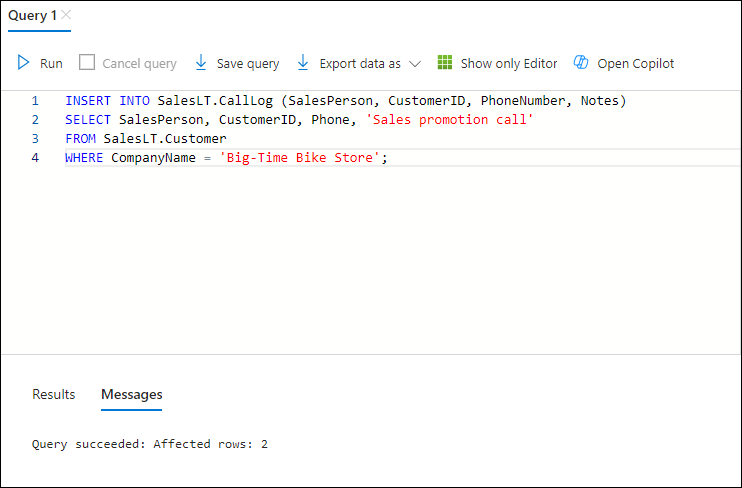
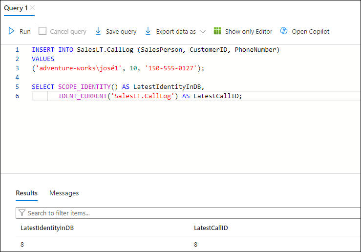
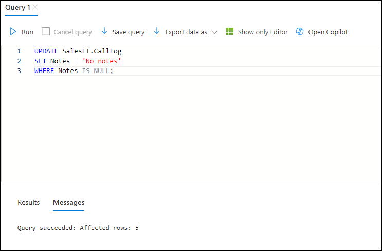
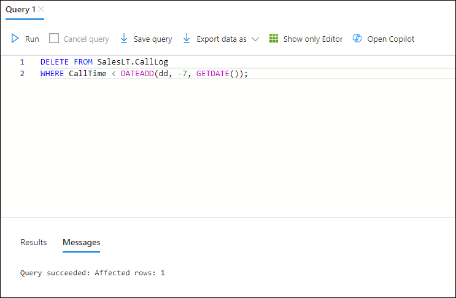

---
lab:
    title: 'Modify Data'
    module: 'Module 5: Modifying Data'
---

# Modify Data

In this exercise, you'll insert, update, and delete data in the **Adventureworks** database.

> **Note**: This exercise assumes you have created the sample **AdventureWorks** database.

## Insert data

You use the **INSERT** statement to insert data into a table.

1. Open a query editor for your **AdventureWorks** database, and create a new query.
1. In the query editor, enter the following code to create a new table named **SalesLT.CallLog**, which we'll use in this exercise.

    ```sql
    CREATE TABLE SalesLT.CallLog
    (
        CallID int IDENTITY PRIMARY KEY NOT NULL,
        CallTime datetime NOT NULL DEFAULT GETDATE(),
        SalesPerson nvarchar(256) NOT NULL,
        CustomerID int NOT NULL REFERENCES SalesLT.Customer(CustomerID),
        PhoneNumber nvarchar(25) NOT NULL,
        Notes nvarchar(max) NULL
    );
    ```

1. Run the code and create the table. Don't worry too much about the details of the **CREATE TABLE** statement - it creates a table with some fields that we'll use in subsequent tasks to insert, update, and delete data.
1. Create a new query, so you have two query panes, and in the new pane, enter the following code to query the  **SalesLT.CallLog** you just created.

    ```sql
    SELECT * FROM SalesLT.CallLog;
    ```

1. Run the **SELECT** query and view the results, which show the columns in the new table but no rows, because the table is empty.
1. Switch back to the query pane containing the **CREATE TABLE** statement, and replace it with the following **INSERT** statement to insert a new row into the **SalesLT.CallLog** table.

    ```sql
    INSERT INTO SalesLT.CallLog
    VALUES
    ('2015-01-01T12:30:00', 'adventure-works\pamela0', 1, '245-555-0173', 'Returning call re: enquiry about delivery');
    ```

1. Run the query and review the message, which should indicate that 1 row was affected.
1. Switch to the query pane containing the **SELECT** query and run it. Note that the results contain the row you inserted. The **CallID** column is an *identity* column that is automatically incremented (so the first row has the value **1**), and the remaining columns contain the values you specified in the **INSERT** statement
1. Switch back to the query pane containing the **INSERT** statement, and replace it  with the following code to insert another row. This time, the **INSERT** statement takes advantage of the fact that the table has a default value defined for the **CallTime** field, and allows *NULL* values in the **Notes** field.

    ```sql
    INSERT INTO SalesLT.CallLog
    VALUES
    (DEFAULT, 'adventure-works\david8', 2, '170-555-0127', NULL);
    ```

1. Run the query and review the message, which should indicate that 1 row was affected.
1. Switch to the query pane containing the **SELECT** query and run it. Note that the second row has been inserted, with the default value for the **CallTime** field (the current time when the row was inserted) and *NULL* for the **Notes** field.
1. Switch back to the query pane containing the **INSERT** statement, and replace it  with the following code to insert another row. This time, the **INSERT** statement explicitly lists the columns into which the new values will be inserted. The columns not specified in the statement support either default or *NULL* values, so they can be omitted.

    ```sql
    INSERT INTO SalesLT.CallLog (SalesPerson, CustomerID, PhoneNumber)
    VALUES
    ('adventure-works\jillian0', 3, '279-555-0130');
    ```

1. Run the query and review the message, which should indicate that 1 row was affected.
    
1. Switch to the query pane containing the **SELECT** query and run it. Note that the third row has been inserted, once again using the default value for the **CallTime** field and *NULL* for the **Notes** field.
1. Switch back to the query pane containing the **INSERT** statement, and replace it  with the following code, which inserts two rows of data into the **SalesLT.CallLog** table.

    ```sql
    INSERT INTO SalesLT.CallLog
    VALUES
    (DATEADD(mi,-2, GETDATE()), 'adventure-works\jillian0', 4, '710-555-0173', NULL),
    (DEFAULT, 'adventure-works\shu0', 5, '828-555-0186', 'Called to arrange deliver of order 10987');
    ```

1. Run the query and review the message, which should indicate that 2 rows were affected.
1. Switch to the query pane containing the **SELECT** query and run it. Note that two new rows have been added to the table.
1. Switch back to the query pane containing the **INSERT** statement, and replace it  with the following code, which inserts the results of a **SELECT** query into the **SalesLT.CallLog** table.

    ```sql
    INSERT INTO SalesLT.CallLog (SalesPerson, CustomerID, PhoneNumber, Notes)
    SELECT SalesPerson, CustomerID, Phone, 'Sales promotion call'
    FROM SalesLT.Customer
    WHERE CompanyName = 'Big-Time Bike Store';
    ```  

1. Run the query and review the message, which should indicate that 2 rows were affected.
    
1. Switch to the query pane containing the **SELECT** query and run it. Note that two new rows have been added to the table. These are the rows that were retrieved by the **SELECT** query.
1. Switch back to the query pane containing the **INSERT** statement, and replace it  with the following code, which inserts a row and then uses the **SCOPE_IDENTITY** function to retrieve the most recent *identity* value that has been assigned in the database (to any table), and also the **IDENT_CURRENT** function, which retrieves the latest *identity* value in the specified table.

    ```sql
    INSERT INTO SalesLT.CallLog (SalesPerson, CustomerID, PhoneNumber)
    VALUES
    ('adventure-works\josé1', 10, '150-555-0127');

    SELECT SCOPE_IDENTITY() AS LatestIdentityInDB,
           IDENT_CURRENT('SalesLT.CallLog') AS LatestCallID;
    ```

1. Run the code and review the results, which should be two numeric values, both the same.
    
1. Switch to the query pane containing the **SELECT** query and run it to validate that the new row that has been inserted has a **CallID** value that matches the *identity* value returned when you inserted it.
1. Switch back to the query pane containing the **INSERT** statement, and replace it  with the following code, which enables explicit insertion of *identity* values and inserts a new row with a specified **CallID** value, before disabling explicit *identity* insertion again.

    ```sql
    SET IDENTITY_INSERT SalesLT.CallLog ON;

    INSERT INTO SalesLT.CallLog (CallID, SalesPerson, CustomerID, PhoneNumber)
    VALUES
    (20, 'adventure-works\josé1', 11, '926-555-0159');

    SET IDENTITY_INSERT SalesLT.CallLog OFF;
    ```

1. Run the code and review the results, which should affect 1 row.
1. Switch to the query pane containing the **SELECT** query and run it to validate that a new row has been inserted with the specific **CallID** value you specified in the **INSERT** statement (9).

## Update data

To modify existing rows in a table, use the **UPDATE** statement.

1. On the query pane containing the **INSERT** statement, replace the existing code with the following code.

    ```sql
    UPDATE SalesLT.CallLog
    SET Notes = 'No notes'
    WHERE Notes IS NULL;
    ```

2. Run the **UPDATE** statement and review the message, which should indicate the number of rows affected.
    
3. Switch to the query pane containing the **SELECT** query and run it. Note that the rows that previously had *NULL* values for the **Notes** field now contain the text *No notes*.
4. Switch back to the query pane containing the **UPDATE** statement, and replace it with the following code, which updates multiple columns.

    ```sql
    UPDATE SalesLT.CallLog
    SET SalesPerson = '', PhoneNumber = ''
    ```

5. Run the **UPDATE** statement and note the number of rows affected.
6. Switch to the query pane containing the **SELECT** query and run it. Note that *all* rows have been updated to remove the **SalesPerson** and **PhoneNumber** fields - this emphasizes the danger of accidentally omitting a **WHERE** clause in an **UPDATE** statement.
7. Switch back to the query pane containing the **UPDATE** statement, and replace it with the following code, which updates the **SalesLT.CallLog** table based on the results of a **SELECT** query.

    ```sql
    UPDATE SalesLT.CallLog
    SET SalesPerson = c.SalesPerson, PhoneNumber = c.Phone
    FROM SalesLT.Customer AS c
    WHERE c.CustomerID = SalesLT.CallLog.CustomerID;
    ```

8. Run the **UPDATE** statement and note the number of rows affected.
9. Switch to the query pane containing the **SELECT** query and run it. Note that the table has been updated using the values returned by the **SELECT** statement.

## Delete data

To delete rows in the table, you generally use the **DELETE** statement; though you can also remove all rows from a table by using the **TRUNCATE TABLE** statement.

1. On the query pane containing the **UPDATE** statement, replace the existing code with the following code.

    ```sql
    DELETE FROM SalesLT.CallLog
    WHERE CallTime < DATEADD(dd, -7, GETDATE());
    ```

2. Run the **DELETE** statement and review the message, which should indicate the number of rows affected.
    
3. Switch to the query pane containing the **SELECT** query and run it. Note that rows with a **CallDate** older than 7 days have been deleted.
4. Switch back to the query pane containing the **DELETE** statement, and replace it with the following code, which uses the **TRUNCATE TABLE** statement to remove all rows in the table.

    ```sql
    TRUNCATE TABLE SalesLT.CallLog;
    ```

5. Run the **TRUNCATE TABLE** statement and note the number of rows affected.
6. Switch to the query pane containing the **SELECT** query and run it. Note that *all* rows have been deleted from the table.

## Challenges

Now it's your turn to try modifying some data.

> **Tip**: Try to determine the appropriate code for yourself. If you get stuck, suggested answers are provided at the end of this lab.

### Challenge 1: Insert products

Each Adventure Works product is stored in the **SalesLT.Product** table, and each product has a unique **ProductID** identifier, which is implemented as an *identity* column in the **SalesLT.Product** table. Products are organized into categories, which are defined in the **SalesLT.ProductCategory** table. The products and product category records are related by a common **ProductCategoryID** identifier, which is an *identity* column in the **SalesLT.ProductCategory** table.

1. Insert a product
    - Adventure Works has started selling the following new product. Insert it into the **SalesLT.Product** table, using default or *NULL* values for unspecified columns:
        - **Name**: LED Lights
        - **ProductNumber**: LT-L123
        - **StandardCost**: 2.56
        - **ListPrice**: 12.99
        - **ProductCategoryID**: 37
        - **SellStartDate**: *Today's date*
    - After you have inserted the product, run a query to determine the **ProductID** that was generated.
    - Then run a query to view the row for the product in the **SalesLT.Product** table.
2. Insert a new category with two products
    - Adventure Works is adding a product category for *Bells and Horns* to its catalog. The parent category for the new category is **4** (*Accessories*). This new category includes the following two new products:
        - First product:
            - **Name**: Bicycle Bell
            - **ProductNumber**: BB-RING
            - **StandardCost**: 2.47
            - **ListPrice**: 4.99
            - **ProductCategoryID**: *The **ProductCategoryID** for the new Bells and Horns category*
            - **SellStartDate**: *Today's date*
        - Second product:
            - **Name**: Bicycle Horn
            - **ProductNumber**: BB-PARP
            - **StandardCost**: 1.29
            - **ListPrice**: 3.75
            - **ProductCategoryID**: *The **ProductCategoryID** for the new Bells and Horns category*
            - **SellStartDate**: *Today's date*
    - Write a query to insert the new product category, and then insert the two new products with the appropriate **ProductCategoryID** value.
    - After you have inserted the products, query the **SalesLT.Product** and **SalesLT.ProductCategory** tables to verify that the data has been inserted.

### Challenge 2: Update products

You have inserted data for a product, but the pricing details are not correct. You must now update the records you have previously inserted to reflect the correct pricing. Tip: Review the documentation for UPDATE in the Transact-SQL Language Reference.

1. Update product prices
    - The sales manager at Adventure Works has mandated a 10% price increase for all products in the *Bells and Horns* category. Update the rows in the **SalesLT.Product** table for these products to increase their price by 10%.

2. Discontinue products
    - The new LED lights you inserted in the previous challenge are to replace all previous light products. Update the **SalesLT.Product** table to set the **DiscontinuedDate** to today’s date for all products in the Lights category (product category ID **37**) other than the LED Lights product you inserted previously.

### Challenge 3: Delete products

The Bells and Horns category has not been successful, and it must be deleted from the database.

1. Delete a product category and its products
    - Delete the records for the *Bells and Horns* category and its products. You must ensure that you delete the records from the tables in the correct order to avoid a foreign-key constraint violation.

## Challenge Solutions

This section contains suggested solutions for the challenge queries.

### Challenge 1

1. Insert a product:

    ```sql
    INSERT INTO SalesLT.Product (Name, ProductNumber, StandardCost, ListPrice, ProductCategoryID, SellStartDate)
    VALUES
    ('LED Lights', 'LT-L123', 2.56, 12.99, 37, GETDATE());

    SELECT SCOPE_IDENTITY();

    SELECT * FROM SalesLT.Product
    WHERE ProductID = SCOPE_IDENTITY();
    ```

2. Insert a new category with two products:

    ```sql
    INSERT INTO SalesLT.ProductCategory (ParentProductCategoryID, Name)
    VALUES
    (4, 'Bells and Horns');

    INSERT INTO SalesLT.Product (Name, ProductNumber, StandardCost, ListPrice, ProductCategoryID, SellStartDate)
    VALUES
    ('Bicycle Bell', 'BB-RING', 2.47, 4.99, IDENT_CURRENT('SalesLT.ProductCategory'), GETDATE()),
    ('Bicycle Horn', 'BH-PARP', 1.29, 3.75, IDENT_CURRENT('SalesLT.ProductCategory'), GETDATE());

    SELECT c.Name As Category, p.Name AS Product
    FROM SalesLT.Product AS p
    JOIN SalesLT.ProductCategory as c
        ON p.ProductCategoryID = c.ProductCategoryID
    WHERE p.ProductCategoryID = IDENT_CURRENT('SalesLT.ProductCategory');
    ```

### Challenge 2

1. Update product prices:

    ```sql
    UPDATE SalesLT.Product
    SET ListPrice = ListPrice * 1.1
    WHERE ProductCategoryID =
        (SELECT ProductCategoryID
         FROM SalesLT.ProductCategory
         WHERE Name = 'Bells and Horns');
    ```

2. Discontinue products:

    ```sql
    UPDATE SalesLT.Product
    SET DiscontinuedDate = GETDATE()
    WHERE ProductCategoryID = 37
    AND ProductNumber <> 'LT-L123';
    ```

### Challenge 3

1. Delete a product category and its products:

    ```sql
    DELETE FROM SalesLT.Product
    WHERE ProductCategoryID =
        (SELECT ProductCategoryID
         FROM SalesLT.ProductCategory
         WHERE Name = 'Bells and Horns');

    DELETE FROM SalesLT.ProductCategory
    WHERE ProductCategoryID =
        (SELECT ProductCategoryID
         FROM SalesLT.ProductCategory
         WHERE Name = 'Bells and Horns');
    ```
