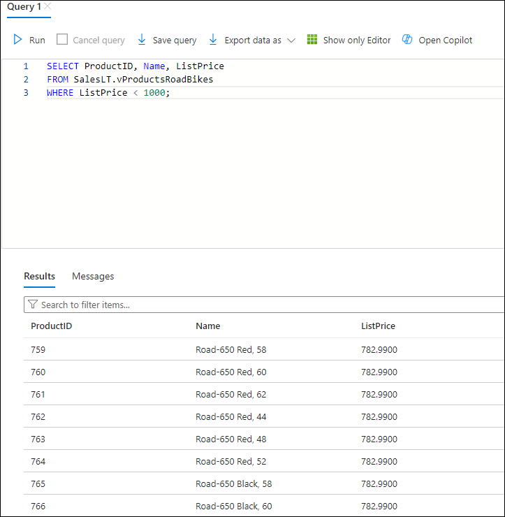
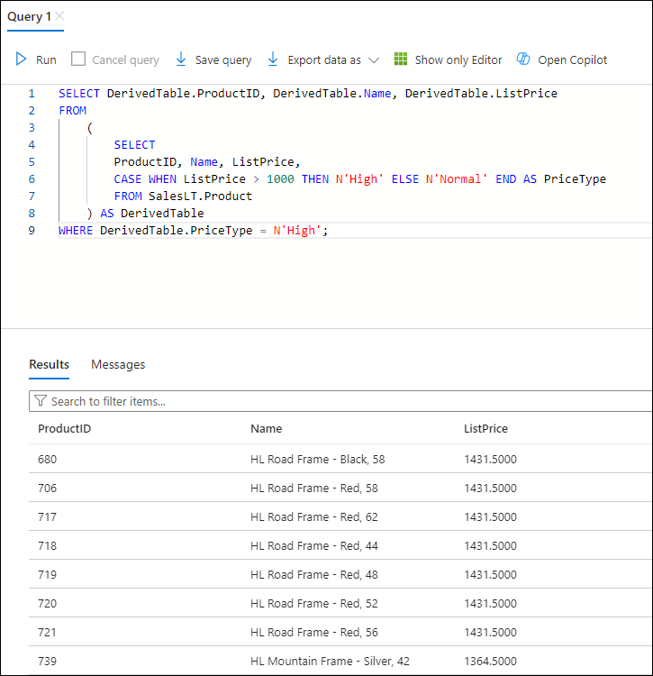

---
lab:
    title: 'Create queries with table expressions'
    module: 'Additional exercises'
---

# Create queries with table expressions

In this exercise, you'll use table expressions to query the **Adventureworks** database.

> **Note**: This exercise assumes you have created the **Adventureworks** database.

## Create a view

A view is a predefined query that you can query like a table.

1. Open a query editor for your **Adventureworks** database, and create a new query.
1. In the query editor, enter the following code to retrieve all products that are classified as road bikes (*ProductCategoryID=6*) from the **SalesLT.Products** table:

    ```sql
    SELECT ProductID, Name, ListPrice
    FROM SalesLT.Product
    WHERE ProductCategoryID = 6;
    ```

1. Run your query and view the results.

1. The query returned all products that are categorized as road bikes. But what if you wanted to use a view for this data to ensure applications don't need to access the underlying table to fetch it? Modify the code to add a CREATE VIEW clause as shown here:

    ```sql
    CREATE VIEW SalesLT.vProductsRoadBikes AS
    SELECT ProductID, Name, ListPrice
    FROM SalesLT.Product
    WHERE ProductCategoryID = 6;
    ```

1. This code creates a view called **vProductsRoadBikes** for all road bikes. Run the code and create the view.

## Query a view

You've created your view. Now you can use it. For example, you can use your view to get a list of any road bikes based on their **ListPrice**.

1. In the query editor, replace the code you entered previously with the following code:

    ```sql
    SELECT ProductID, Name, ListPrice
    FROM SalesLT.vProductsRoadBikes
    WHERE ListPrice < 1000;
    ```

1. Run the query and review the results. You've queried your view and retrieved a list of any road bikes that have a **ListPrice** under 1000. Your query uses your view as a source for the data. This means your applications can use your view for specific searches like this, and won't need to query the underlying table to fetch the data they need.
    

## Use a derived table

Sometimes you might end up having to rely on complex queries. You can use derived tables in place of those complex queries to avoid adding to their complexity.

1. In the query editor, replace the code you entered previously with the following code:

    ```sql
    SELECT ProductID, Name, ListPrice,
           CASE WHEN ListPrice > 1000 THEN N'High' ELSE N'Normal' END AS PriceType
    FROM SalesLT.Product;
    ```

1. Run the query, which calculates whether the price of a product is considered high or normal.
1. Now let's further build on this query based on additional criteria, without adding to its complexity. In order to do this, you can create a derived table, which you can think of conceptually as a view that is defined within the context of another query. Replace the previous code with the code below:

    ```sql
    SELECT DerivedTable.ProductID, DerivedTable.Name, DerivedTable.ListPrice
    FROM
        (
            SELECT
            ProductID, Name, ListPrice,
            CASE WHEN ListPrice > 1000 THEN N'High' ELSE N'Normal' END AS PriceType
            FROM SalesLT.Product
        ) AS DerivedTable
    WHERE DerivedTable.PriceType = N'High';
    ```

1. Run the code, which defines a derived table and fetches the **ProductID**, **Name**, and **ListPrice** of products that have a **PriceType** of *High* only. Your derived table enabled you to easily build on top of your initial query based on your additional criteria, without making the initial query any more complex.

    
## Challenges

Now it's your turn to use table expressions.

> **Tip**: Try to determine the appropriate code for yourself. If you get stuck, suggested answers are provided at the end of this lab.

### Challenge 1: Create a view

Adventure Works is forming a new sales team located in Canada. The team wants to create a map of all of the customer addresses in Canada. This team will need access to address details on Canadian customers only. Your manager has asked you to make sure that the team can get the data they require, but ensure that they don't access the underlying source data when getting their information.

To carry out the task do the following:

1. Write a Transact-SQL query to create a view for customer addresses in Canada.
   - Create a view based on the following columns in the **SalesLT.Address** table:
      - **AddressLine1**
      - **City**
      - **StateProvince**
      - **CountryRegion**
   - In your query, use the **CountryRegion** column to filter for addresses located in *Canada* only.

1. Query your new view.
   - Fetch the rows in your newly created view to ensure it was created successfully. Notice that it only shows address in Canada.

### Challenge 2: Use a derived table

The transportation team at Adventure Works wants to optimize its processes. Products that weigh more than 1000 are considered to be heavy products, and will also need to use a new transportation method if their list price is over 2000. You've been asked to classify products according to their weight, and then provide a list of products that meet both these weight and list price criteria.

To help, you'll:

1. Write a query that classifies products as heavy and normal based on their weight.
   - Use the **Weight** column to decide whether a product is heavy or normal.

1. Create a derived table based on your query
   - Use your derived table to find any heavy products with a list price over 2000.
   - Make sure to select the following columns: **ProductID, Name, Weight, ListPrice**.

## Challenge Solutions

This section contains suggested solutions for the challenge queries.

### Challenge 1

1. Write a Transact-SQL query to create a view for customer addresses in Canada.

    ```sql
    CREATE VIEW SalesLT.vAddressCA AS
    SELECT AddressLine1, City, StateProvince, CountryRegion
    FROM SalesLT.Address
    WHERE CountryRegion = 'Canada';
    ```

1. Query your new view.

    ```sql
    SELECT * FROM SalesLT.vAddressCA;
    ```

### Challenge 2

1. Write a query that classifies products as heavy and normal based on their weight.

    ```sql
    SELECT ProductID, Name, Weight, ListPrice,
           CASE WHEN Weight > 1000 THEN N'Heavy' ELSE N'Normal' END AS WeightType
    FROM SalesLT.Product;
    ```

1. Create a derived table based on your query.

    ```sql
    SELECT DerivedTable.ProductID, DerivedTable.Name, DerivedTable.Weight, DerivedTable.ListPrice
    FROM
        (
            SELECT ProductID, Name, Weight, ListPrice,
                   CASE WHEN Weight > 1000. THEN N'Heavy' ELSE N'Normal' END AS WeightType
            FROM SalesLT.Product
        ) AS DerivedTable
    WHERE DerivedTable.WeightType = N'Heavy' AND DerivedTable.ListPrice > 2000;
    ```
