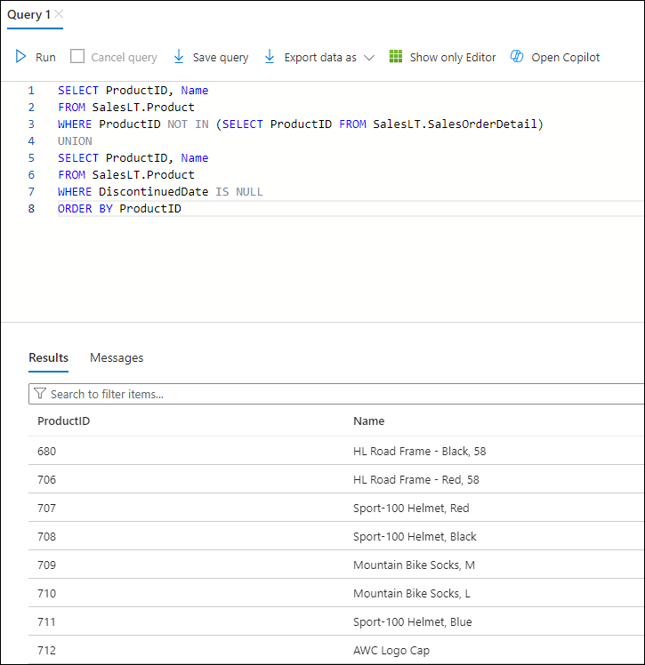
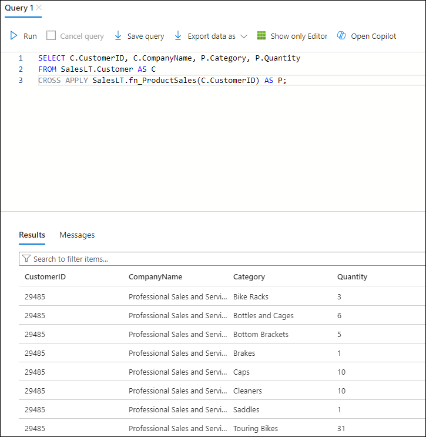

---
lab:
    title: 'Combine query results with set operators'
    module: 'Additional exercises'
---
# Combine query results with set operators

In this lab, you will use set operators to retrieve results from the **Adventureworks** database.

> **Note**: This exercise assumes you have created the **Adventureworks** database.

## Write a query that uses the UNION operator

The UNION operator enables you to combine the results from multiple queries into a single result set.

1. Open a query editor for your **Adventureworks** database, and create a new query.
1. In the query editor, enter the following code:

    ```sql
    SELECT ProductID, Name
    FROM SalesLT.Product
    WHERE ProductID NOT IN (SELECT ProductID FROM SalesLT.SalesOrderDetail)
    ORDER BY ProductID
    ```

1. Run the query, which returns the ID and name of all products that have not been sold. Then view the results and messages to observe how many rows were returned by this query.
1. Under the query to return unsold products, add the following code:

    ```sql
    SELECT ProductID, Name
    FROM SalesLT.Product
    WHERE DiscontinuedDate IS NULL
    ```

1. Select <u>only the code you just added</u> (which retrieves the ID and name of all products that are not discontinued) and run it. Then view the results and messages to observe how many rows were returned by this query.
1. Modify the code by adding a UNION operator between the two queries:

    ```sql
    SELECT ProductID, Name
    FROM SalesLT.Product
    WHERE ProductID NOT IN (SELECT ProductID FROM SalesLT.SalesOrderDetail)
    UNION
    SELECT ProductID, Name
    FROM SalesLT.Product
    WHERE DiscontinuedDate IS NULL
    ORDER BY ProductID
    ```

1. Run the entire query, and view the results and messages. The results include a row for each product for which there have been no sales *or*  that has not been discontinued. Rows with the same values in each column from multiple queries are consolidated into a single row in the results - eliminating duplicate rows for products that are both unsold and not discontinued.
    
1. Modify the query to add the ALL keyword to the UNION operator:

    ```sql
    SELECT ProductID, Name
    FROM SalesLT.Product
    WHERE ProductID NOT IN (SELECT ProductID FROM SalesLT.SalesOrderDetail)
    UNION ALL
    SELECT ProductID, Name
    FROM SalesLT.Product
    WHERE DiscontinuedDate IS NULL
    ORDER BY ProductID
    ```

1. Run the modified query, and view the results and messages. The results include a row for each product that has not been discontinued *and* for each product that has not been sold. Some products are listed twice (once because they have not been sold, and once because they have not been discontinued). The ALL keyword produces results that include all rows returned by all of the individual queries - which may result in duplicates.

## Write a query that uses the INTERSECT operator

Now let's try a query using the INTERSECT operator.

1. Modify the query to replace the UNION ALL operator with the INTERSECT operator:

    ```sql
    SELECT ProductID, Name
    FROM SalesLT.Product
    WHERE ProductID NOT IN (SELECT ProductID FROM SalesLT.SalesOrderDetail)
    INTERSECT
    SELECT ProductID, Name
    FROM SalesLT.Product
    WHERE DiscontinuedDate IS NULL
    ORDER BY ProductID
    ```

1. Run the query, and view the results and messages. The results include a row for each product for which there have been no sales *and* that has not been discontinued. The results of the INTERSECT operator include only rows that are returned by all of the individual queries.

## Write a query that uses the EXCEPT operator

Now let's try a query using the EXCEPT operator.

1. Modify the query to replace the INTERSECT operator with the EXCEPT operator:

    ```sql
    SELECT ProductID, Name
    FROM SalesLT.Product
    WHERE ProductID NOT IN (SELECT ProductID FROM SalesLT.SalesOrderDetail)
    EXCEPT
    SELECT ProductID, Name
    FROM SalesLT.Product
    WHERE DiscontinuedDate IS NULL
    ORDER BY ProductID
    ```

1. Run the query, and view the results and messages. The results include a row for each unsold product other than products that have not been discontinued. The results of the EXCEPT operator include only rows that are returned by the queries *before* the EXCEPT operator.

## Write a query that uses the CROSS APPLY operator

Now you will write a table-valued function to return the product category and quantity ordered by specific customers.

1. Create a new query and enter the following code:

    ```sql
    CREATE OR ALTER FUNCTION SalesLT.fn_ProductSales (@CustomerID int)
    RETURNS TABLE
    RETURN
        SELECT C.[Name] AS 'Category', SUM(D.OrderQty) AS 'Quantity'
            FROM SalesLT.SalesOrderHeader AS H
                INNER JOIN SalesLT.SalesOrderDetail AS D
                    ON H.SalesOrderID = D.SalesOrderID
                INNER JOIN SalesLT.Product AS P
                    ON D.ProductID = P.ProductID
                INNER JOIN SalesLT.ProductCategory AS C
                    ON P.ProductCategoryID = C.ProductCategoryID
            WHERE H.CustomerID = @CustomerID
                GROUP BY C.[Name]
    ```

1. Run the code to create the function.

1. Now, use the following code to pass the **CustomerID** to the table-valued function in a CROSS APPLY statement within a query, retrieving details of sales for each customer returned by the query:

    ```sql
    SELECT C.CustomerID, C.CompanyName, P.Category, P.Quantity
    FROM SalesLT.Customer AS C
    CROSS APPLY SalesLT.fn_ProductSales(C.CustomerID) AS P;
    ```

1. Run the query and view the results.
    
## Challenge

Use the following code to create a table-valued function that retrieves address details for a given customer:

```sql
CREATE OR ALTER FUNCTION SalesLT.fn_CustomerAddresses (@CustomerID int)
RETURNS TABLE
RETURN
    SELECT ca.AddressType, a.AddressLine1, a.AddressLine2, a.City, a.StateProvince, a.CountryRegion, a.PostalCode
    FROM SalesLT.CustomerAddress as ca
    JOIN SalesLT.Address AS a
        ON a.AddressID = ca.AddressID
    WHERE ca.CustomerID = @CustomerID
```

Now write a query that returns every customer ID and company name along with all of the address fields retrieved by the function.

> **Tip**: Try to determine the appropriate code for yourself. If you get stuck, a suggested answer is provided below.

## Challenge Solution

This section contains a suggested solution for the challenge query.

```sql
SELECT c.CustomerID, c.CompanyName, a.*
    FROM SalesLT.Customer AS c
    CROSS APPLY SalesLT.fn_CustomerAddresses(c.CustomerID) AS a
ORDER BY c.CustomerID;
```
