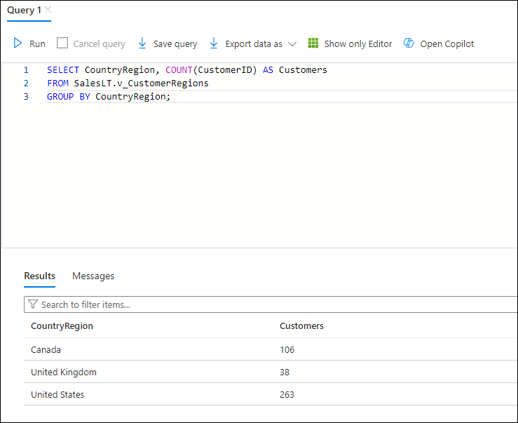
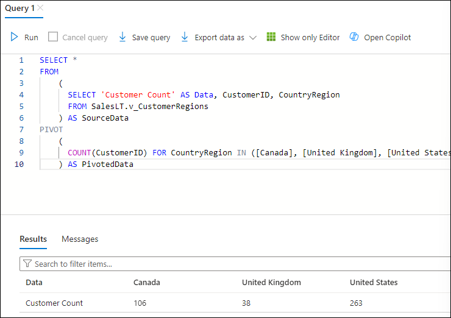

---
lab:
    title: 'Use pivoting and grouping sets'
    module: 'Additional exercises'
---

# Use pivoting and grouping sets

In this exercise, you'll use pivoting and grouping sets to query the **Adventureworks** database.

> **Note**: This exercise assumes you have created the **Adventureworks** database.

## Pivot data using the PIVOT operator

1. Open a query editor for your **Adventureworks** database, and create a new query.
1. In the query editor, enter the following code to create a view that contains the ID, company name, and main office region for all customers

    ```sql
    CREATE VIEW SalesLT.v_CustomerRegions
    AS
    SELECT c.CustomerID, c.CompanyName,a. CountryRegion
    FROM SalesLT.Customer AS c
    JOIN SalesLT.CustomerAddress AS ca
        ON c.CustomerID = ca.CustomerID
    JOIN SalesLT.Address AS a
        ON ca.AddressID = a.AddressID
    WHERE ca.AddressType = 'Main Office';
    GO
    ```

1. Run your code to create the view.
    
1. You can now query the view to retrieve information about the regions where customers have their main office. For example, run the following query:

    ```sql
    SELECT CountryRegion, COUNT(CustomerID) AS Customers
    FROM SalesLT.v_CustomerRegions
    GROUP BY CountryRegion;
    ```

    The query returns the number of customers in each region. Howeverm suppose you wanted the data presented as a single row that contains the number of offices in each region, like this:

    | Data | Canada | United Kingdom | United States |
    |--|--|--|--|
    | Customer Count | 106 | 38 | 263 |

1. To accomplish this, you can use retrieve the necessary columns (**CustomerID** and **CountryRegion** and a literal "Customer Count" row header) from the view, and then use the PIVOT operator to count the customer IDs in each named region, like this:

    ```sql
    SELECT *
    FROM
        (
          SELECT 'Customer Count' AS Data, CustomerID, CountryRegion
          FROM SalesLT.v_CustomerRegions
        ) AS SourceData
    PIVOT 
        (
          COUNT(CustomerID) FOR CountryRegion IN ([Canada], [United Kingdom], [United States])
        ) AS PivotedData
    ```

1. Run the query to view the results.

    

## Group data using a grouping subclause

Use subclauses like **GROUPING SETS**, **ROLLUP**, and **CUBE** to group data in different ways. Each subclause allows you to group data in a unique way. For instance, **ROLLUP** allows you to dictate a hierarchy and provides a grand total for your groupings. Alternatively, you can use **CUBE** to get all possible combinations for groupings.

For example, let's see how you can use **ROLLUP** to group a set of data.

1. Create a view that includes details of sales of products to customers from multiple tables in the database. To do this, Run the following code:

    ```sql
    CREATE VIEW SalesLT.v_ProductSales AS 
    SELECT c.CustomerID, c.CompanyName, c.SalesPerson,
           a.City, a.StateProvince, a.CountryRegion,
           p.Name As Product, pc.Name AS Category,
           o.SubTotal + o.TaxAmt + o.Freight AS TotalDue 
    FROM SalesLT.Customer AS c
    INNER JOIN SalesLT.CustomerAddress AS ca
        ON c.CustomerID = ca.CustomerID
    INNER JOIN SalesLT.Address AS a
        ON ca.AddressID = a.AddressID
    INNER JOIN SalesLT.SalesOrderHeader AS o
        ON c.CustomerID = o.CustomerID
    INNER JOIN SalesLT.SalesOrderDetail AS od
        ON o.SalesOrderID = od.SalesOrderID
    INNER JOIN SalesLT.Product AS p
        ON od.ProductID = p.ProductID
    INNER JOIN SalesLT.ProductCategory AS pc
        ON p.ProductCategoryID = pc.ProductCategoryID
    WHERE ca.AddressType = 'Main Office';
    ```

1. Your view (**SalesLT.v_ProductSales**) enables you to summarize sales by attributes of products (for example category) and attributes of customers (for example, geographical location). Run the query below to view sales totals grouped by geographical region and product category:

    ```sql
    SELECT CountryRegion, Category, SUM(TotalDue) AS TotalSales
    FROM SalesLT.v_ProductSales
    GROUP BY CountryRegion, Category
    ```

    The results show the sales totals for each combination of region and product category.

1. Now let's use **ROLLUP** to group this data. Replace your previous code with the code below:

    ```sql
    SELECT CountryRegion, Category, SUM(TotalDue) AS TotalSales
    FROM SalesLT.v_ProductSales
    GROUP BY ROLLUP (CountryRegion, Category);
    ```

1. Run the query and review the results.

    The results contain a row for each region and product category as before. Additionally, after the rows for each region there is a row containing a *NULL* category and the subtotal for all products sold in that region, and at the end of the resultset there's a row with NULL region and category values containing the grand total for sales of all product categories in all regions.

1. Modify the query to use the CUBE operator instead of ROLLUP:

    ```sql
    SELECT CountryRegion, Category, SUM(TotalDue) AS TotalSales
    FROM SalesLT.v_ProductSales
    GROUP BY CUBE (CountryRegion, Category);
    ```

1. Run the modified query and review the results.

    This time, the results include:
    - Sales for each category in each region
    - A subtotal for each product category in all regions (with a *NULL* **CountryRegion**)
    - A subtotal for each region for all product categories (with a *NULL* **Category**)
    - A grand total for sales of all product categories in all regions (with *NULL* **CountryRegion** and **Category** values)

## Challenges

Now it's your turn to pivot and group data.

> **Tip**: Try to determine the appropriate code for yourself. If you get stuck, suggested answers are provided at the end of this lab.

### Challenge 1: Count product colors by category

The Adventure Works marketing team wants to conduct research into the relationship between colors and products. To give them a starting point, you've been asked to provide information on how many products are available across the different color types.

- Use the **SalesLT.Product** and **SalesLT.ProductCategory** tables to get a list of products, their colors, and product categories.
- Pivot the data so that the colors become columns with a value indicating how many products in each category are that color.

### Challenge 2: Aggregate sales data by product and salesperson

The sales team at Adventure Works wants to compare sales of individual products by salesperson.
To accomplish this, write a query that groups data from the **SalesLT.v_ProductSales** view you created previously to return:

- The sales amount for each product by each salesperson
- The subtotal of sales for each product by all salespeople
- The grand total for all products by all saleseople

## Challenge Solutions

This section contains suggested solutions for the challenge queries.

### Challenge 1

```sql
SELECT *
FROM 
(
  SELECT P.ProductID, PC.Name AS Category, ISNULL(P.Color, 'Uncolored') AS Color 
  FROM Saleslt.ProductCategory AS PC 
  JOIN SalesLT.Product AS P 
      ON PC.ProductCategoryID = P.ProductCategoryID
) AS ProductColors
PIVOT
(
  COUNT(ProductID) FOR Color IN(
    [Red], [Blue], [Black], [Silver], [Yellow], 
    [Grey], [Multi], [Uncolored])
) AS ColorCountsByCategory 
ORDER BY Category;
```

### Challenge 2

```sql
SELECT Product, SalesPerson, SUM(TotalDue) AS TotalSales
FROM SalesLT.v_ProductSales
GROUP BY ROLLUP (Product, SalesPerson);
```
