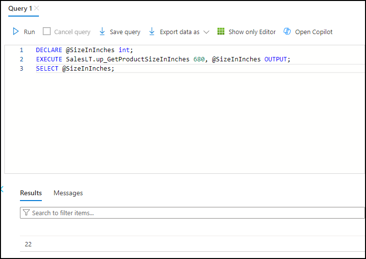
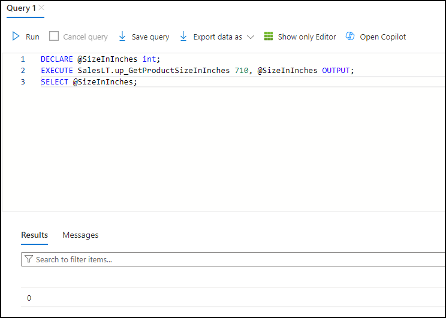

# Implement error handling with Transact-SQL

In this exercise, you'll use various Transact-SQL error handling techniques.

> **Note**: This exercise assumes you have created the **Adventureworks** database.

## Observe unhandled error behavior in Transact-SQL

The Adventureworks database contains details of products, including their size. Numeric values indicate the product size in centimeters, and you will use a stored procedure to convert these sizes to inches. 

1. Open a query editor for your **Adventureworks** database, and create a new query.
1. In the query pane, type the following code:

    ```sql
    CREATE PROCEDURE SalesLT.up_GetProductSizeInInches (@productID int, @SizeInInches int OUTPUT)
    AS
    BEGIN
        SELECT @SizeInInches = CAST(Size AS decimal) * 0.394
        FROM SalesLT.Product
        WHERE ProductID = @productID;
    END;
    ```

1. Run the code to create the stored procedure.
1. Create a second query, and run the following code to test your stored procedure using product *680*, which has a numeric size value:

    ```sql
    DECLARE @SizeInInches int;
    EXECUTE SalesLT.up_GetProductSizeInInches 680, @SizeInInches OUTPUT;
    SELECT @SizeInInches;
    ```

1. Review the results, noting that the size in inches of product *680* is returned successfully.
    
1. Modify the test code to use product *710*, which has the size value "L":

    ```sql
    DECLARE @SizeInInches int;
    EXECUTE SalesLT.up_GetProductSizeInInches 710, @SizeInInches OUTPUT;
    SELECT @SizeInInches;
    ```

1. Run the modified test code and review the output messages. An error occurs, causing query execution to stop.
    

## Use TRY/CATCH to handle an error

Transact-SQL supports structured exception handling through the use of a TRY/CATCH block.

1. Return to the query used to create the stored procedure, and alter the procedure code to add a TRY/CATCH block, like this:

    ```sql
    ALTER PROCEDURE SalesLT.up_GetProductSizeInInches (@productID int, @SizeInInches int OUTPUT)
    AS
    BEGIN
        BEGIN TRY
            SELECT @SizeInInches = CAST(Size AS decimal) * 0.394
            FROM SalesLT.Product
            WHERE ProductID = @productID;
        END TRY
        BEGIN CATCH
            PRINT 'An error occurred';
            SET @sizeInInches = 0;
        END CATCH
    END
    ```

1. Run the code to alter the stored procedure.
1. Return to the query used to test the stored procedure and re-run the code that attempts to get the size for product *710*:

    ```sql
    DECLARE @SizeInInches int;
    EXECUTE SalesLT.up_GetProductSizeInInches 710, @SizeInInches OUTPUT;
    SELECT @SizeInInches;
    ```
1. Review the results, which show the size as *0*. Then review the output messages and note that they include a notification that an error occurred. The code in the CATCH block has handled the error and enabled the stored procedure to fail gracefully.

   

## Capture error details

The message returned in the CATCH block indicates that an error occurred, but provides no details that would help troubleshoot the problem. You can use built-in functions to get more information about the current error and use those to provide more details.

1. Return to the query used to create the stored procedure, and alter the procedure code to print the error number and message, like this:

    ```sql
    ALTER PROCEDURE SalesLT.up_GetProductSizeInInches (@productID int, @SizeInInches int OUTPUT)
    AS
    BEGIN
        BEGIN TRY
            SELECT @SizeInInches = CAST(Size AS decimal) * 0.394
            FROM SalesLT.Product
            WHERE ProductID = @productID;
        END TRY
        BEGIN CATCH
            PRINT 'Error Number: ' + CAST(ERROR_NUMBER() AS varchar(10));
            PRINT 'Error Message: ' + ERROR_MESSAGE();
            SET @sizeInInches = 0;
        END CATCH
    END
    ```

1. Run the code to alter the stored procedure.
1. Return to the query used to test the stored procedure and re-run the code that attempts to get the size for product *710*:

    ```sql
    DECLARE @SizeInInches int;
    EXECUTE SalesLT.up_GetProductSizeInInches 710, @SizeInInches OUTPUT;
    SELECT @SizeInInches;
    ```

1. Review the results, which again show the size as *0*. Then review the output messages and note that they include the error number and message.

    > **Tip**: In this example, the error details are just printed in the query message output. In a production solution, you might write the error details to a log table to assist in troubleshooting.

## Throw the error to the client application

So far, you've used a TRY/CATCH block to handle an error gracefully. The client application that calls the stored procedure does not encounter an exception. In multi-tier application designs, a common practice is to handle exceptions in the data tier to log details for troubleshooting purposes and ensure the integrity of the database, but then propagate the error to the calling application tier, which includes its own exception handling logic. 

1. Return to the query used to create the stored procedure, and alter the procedure code to print the error number and message, like this:

    ```sql
    ALTER PROCEDURE SalesLT.up_GetProductSizeInInches (@productID int, @SizeInInches int OUTPUT)
    AS
    BEGIN
        BEGIN TRY
            SELECT @SizeInInches = CAST(Size AS decimal) * 0.394
            FROM SalesLT.Product
            WHERE ProductID = @productID;
        END TRY
        BEGIN CATCH
            PRINT 'Error Number: ' + CAST(ERROR_NUMBER() AS varchar(10));
            PRINT 'Error Message: ' + ERROR_MESSAGE();
            THROW;
        END CATCH
    END
    ```

1. Run the code to alter the stored procedure.
1. Return to the query used to test the stored procedure and re-run the code that attempts to get the size for product *710*:

    ```sql
    DECLARE @SizeInInches int;
    EXECUTE SalesLT.up_GetProductSizeInInches 710, @SizeInInches OUTPUT;
    SELECT @SizeInInches;
    ```

1. Review the output, which indicates that an error caused the query to fail. Note that the code in the CATCH block intercepted the error and printed details before re-throwing it to the calling client application (in this case, the query editor).

## Challenges

Now it's time to try using what you've learned.

> **Tip**: Try to determine the appropriate solutions for yourself. If you get stuck, suggested answers are provided at the end of this lab.

### Challenge 1: Handle errors gracefully

Adventure Works has decided to calculate shipping cost for products based on their price and weight. A developer has created the following stored procedure to calculate the shipping cost for a specific product:

```sql
CREATE PROCEDURE SalesLT.up_GetShippingPrice (@productID int, @ShippingPrice money OUTPUT)
AS
BEGIN
    DECLARE @price money, @weight decimal;

    SELECT @price = ISNULL(ListPrice, 0.00), @weight = ISNULL(Weight, 0.00)
    FROM SalesLT.Product
    WHERE ProductID = @productID;

    SET @ShippingPrice = @price/@weight;
END
```

When testing the stored procedure with the following code, the developer has found that the procedure works successfully:

```sql
DECLARE @productID int = 680;
DECLARE @shippingPrice money;
EXECUTE SalesLT.up_GetShippingPrice @productID, @shippingPrice OUTPUT
SELECT @shippingPrice;
```

However, when using a different product ID, the stored procedure fails with an error:

```sql
DECLARE @productID int = 710;
DECLARE @shippingPrice money;
EXECUTE SalesLT.up_GetShippingPrice @productID, @shippingPrice OUTPUT
SELECT @shippingPrice;
```

You must modify the stored procedure, without changing the logic used to calculate the shipping price, so that if an error occurs, it is handled gracefully; returning a shipping price of 0.00 and including the error number and message in the query output message.

### Challenge 2: Propagate an error to the calling client application

Having written code to handle errors in the shipping price stored procedure, you must now modify it to handle the error and return its number and message in the output as before, but also cause the error to be propagated back to the client application that called it to be handled there.

## Challenge Solutions

This section contains suggested solutions for the challenge queries.

### Challenge 1

```sql
ALTER PROCEDURE SalesLT.up_GetShippingPrice (@productID int, @ShippingPrice money OUTPUT)
AS
BEGIN
    DECLARE @price money, @weight decimal;

    BEGIN TRY
        SELECT @price = ISNULL(ListPrice, 0.00), @weight = ISNULL(Weight, 0.00)
        FROM SalesLT.Product
        WHERE ProductID = @productID;
        SET @ShippingPrice = @price/@weight;
    END TRY
    BEGIN CATCH
        PRINT 'Error Number: ' + CAST(ERROR_NUMBER() AS varchar(10));
        PRINT 'Error Message: ' + ERROR_MESSAGE();
        SET @ShippingPrice = 0.00;
    END CATCH
END
```

### Challenge 2

```sql
ALTER PROCEDURE SalesLT.up_GetShippingPrice (@productID int, @ShippingPrice money OUTPUT)
AS
BEGIN
    DECLARE @price money, @weight decimal;

    BEGIN TRY
        SELECT @price = ISNULL(ListPrice, 0.00), @weight = ISNULL(Weight, 0.00)
        FROM SalesLT.Product
        WHERE ProductID = @productID;
        SET @ShippingPrice = @price/@weight;
    END TRY
    BEGIN CATCH
        PRINT 'Error Number: ' + CAST(ERROR_NUMBER() AS varchar(10));
        PRINT 'Error Message: ' + ERROR_MESSAGE();
        THROW;
    END CATCH
END
```
